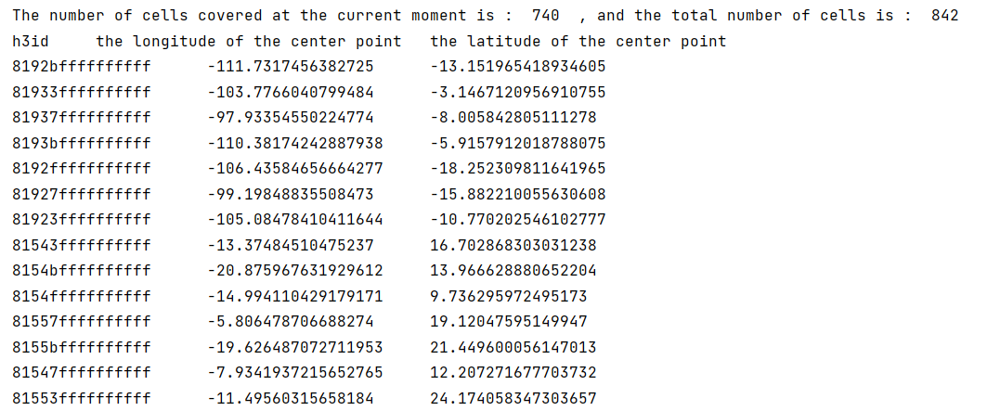

# Beam Placement

This part includes two aspects. One is "framework" part: beam placement plug-in manager, another is the "plug-in" part: various beam placement algorithms.

## Overview

The beam placement module is responsible for determining how satellite beams are directed to cover areas on Earth's surface. StarPerf 2.0 uses a plugin-based architecture that allows for flexible implementation of different beam placement strategies.

## Architecture

The beam placement module consists of:

1. **Framework**: `beam_placement_plugin_manager.py` - manages all beam placement plugins
2. **Plugins**: Various beam placement algorithms (e.g., `random_placement.py`)

## Plug-ins

All plug-ins under this module are beam placement algorithms, and one plug-in represents a beam placement algorithm. We implement the random beam placement algorithm (i.e. `random_placement.py`) by default, and you can write other beam placement algorithm plug-ins by yourself according to the interface specifications.

### Interface Specifications

The interface specifications for beam placement plugins are as follows:

- **Requirement 1**: The storage location of the plug-in is (starting from the root of StarPerf 2.0): `src/TLE_constellation/constellation_beamplacement/beam_placement_plugin/` (for TLE constellation) or `src/XML_constellation/constellation_beamplacement/beam_placement_plugin/` (for XML constellation).

- **Requirement 2**: Each plug-in is a ".py" file, and all source code for the plug-in must be located in this script file.

- **Requirement 3**: The launch entry for a plug-in is a function with the same name as the plug-in.

- **Requirement 4**: The startup function parameter requirements are as follows:

**Table: beam placement plug-ins startup function parameter list**

| Parameter Name | Parameter Type | Parameter Unit | Parameter Meaning |
| :---------------------------: | :------------: | :------------: | :---------------------------------------------------------------------------------------------------------------: |
| sh | shell | - | a shell class object, representing a layer of shell in the constellation |
| h3_resolution | int | - | the resolution of cells divided by h3 library, and currently supported resolutions are: 0/1/2/3/4 |
| antenna_count_per_satellite | int | - | the number of antennas each satellite is equipped with |
| dT | int | second | indicates how often the beam is scheduled, and this value must be less than the orbital period of the satellite |
| minimum_elevation | float | degree | the minimum elevation angle at which a satellite can be seen from a point on the ground |

- **Requirement 5**: The return value of the startup function is all cells covered after executing the beam placement algorithm.

- **Requirement 6**: If one plug-in needs to save intermediate data or result data, the data should be saved in an h5 format file under "data/".

## Framework

This part of the framework consists of 1 py script: `beam_placement_plugin_manager.py`. A beam placement plug-in manager is defined in this script to manage all plug-ins under this module.

The so-called beam placement plug-in manager actually defines a class named `beam_placement_plugin_manager`. The attributes and methods contained in this class and their functions and meanings are shown in the tables below.

### Attributes

**Table: beam placement plug-in manager attributes list**

| Attribute Name | Attribute Type | Attribute Meaning |
| :------------------------------: | :------------: | :-----------------------------------------------------------------------------------------------------------------------------------------------------------------------------------------------: |
| plugins | dict | a dictionary composed of all plug-ins. The "key" is the plug-in name, which is a string type, and the "value" is the plug-in startup function in the corresponding plug-in, which is a function |
| current_beamplacement_policy | str | plug-in name used by the current beam placement plug-in manager |

### Methods

**Table: beam placement plug-in manager methods list**

| Method Name | Parameter List<br />(name : type : unit) | Return Values | Method Function |
| :------------------------------: | :-------------------------------------------------------------------------------------------------------------------------------------------------------: | :------------------------------------: | :----------------------------------------------------------------------------------------------------------------------------------------------------------------------------: |
| \_\_init\_\_ | - | - | initialize an instance of the beam placement plugin manager |
| set_beamplacement_policy | (plugin_name : str : -) | - | set the value of current_beamplacement_policy to plugin_name |
| execute_beamplacement_policy | (sh : shell : - , <br />h3_resolution : int : - , antenna_count_per_satellite : int : - , <br />dT : int : second , minimum_elevation : float : degree) | cells covered by the beam, all cells | according to the value of the current_beamplacement_policy attribute, the startup function of the corresponding plug-in is called to execute the beam placement algorithm. |

## Operating Mechanism

The operating mechanism of this framework is:

1. First instantiate a beam placement plug-in manager object. This object contains two attributes: `plugins` and `current_beamplacement_policy`.
   - `plugins` is a dictionary type attribute used to store various beam placement plugins
   - `current_beamplacement_policy` is a string type used to represent the beam placement plugin used by the current manager

2. During the instantiation of the manager object, the system automatically reads all beam placement plug-ins and stores them in the `plugins`. The key of `plugins` is the name of the plugin, and the value of `plugins` is the startup function of the plugin.

3. After reading all plug-ins, the system sets the value of `current_beamplacement_policy` to "random_placement", indicating that the "random_placement" plug-in is used as the default beam placement algorithm.

4. If you want to execute the beam placement algorithm, you only need to call the `execute_beamplacement_policy` method of the manager object. This method will automatically call the startup function of the plug-in indicated by `current_beamplacement_policy`.

5. If you need to switch the beam placement plug-in, just call the `set_beamplacement_policy` method and pass in the plug-in name you need as a parameter.

6. After you write your own beam placement algorithm plug-in according to the interface specifications introduced earlier, you only need to set `current_beamplacement_policy` as your plug-in name, and the system will automatically recognize your plug-in and execute it.

## Case Study

Now, we take "random_placement" as an example to explain the operation of the beam placement module.

### Step 1: Instantiate the Manager

```python
beamPlacementPluginManager = beam_placement_plugin_manager.beam_placement_plugin_manager()
```

### Step 2: Set the Beam Placement Plugin

```python
beamPlacementPluginManager.set_beamplacement_policy("random_placement")
```

**Note**: The beam placement plug-in manager already sets the `current_beamplacement_policy` value to "random_placement" when initialized, so this step can be omitted here. But if you want to use other beam placement plug-ins, this step cannot be omitted.

### Step 3: Execute the Beam Placement Algorithm

```python
covered_cells_per_timeslot, Cells = beamPlacementPluginManager.execute_beamplacement_policy(
    bent_pipe_constellation.shells[0],
    h3_resolution,
    antenna_count_per_satellite,
    dT,
    minimum_elevation
)
```

There are two return values in Step 3:
- `covered_cells_per_timeslot` represents the cells covered by the beam
- `Cells` represents all cells (including those covered by the beam and those not covered by the beam)

### Results

The code execution results are as follows (part):



The complete code of the above process can be found at: `samples/TLE_constellation/beam_placement/random_placement.py` and `samples/XML_constellation/beam_placement/random_placement.py`.

## Creating Custom Beam Placement Algorithms

To create your own beam placement algorithm:

1. Create a new Python file in the `beam_placement_plugin/` directory
2. Implement a function with the same name as the file
3. Follow the parameter and return value specifications outlined above
4. The plugin will be automatically discovered and loaded by the manager

## Navigation

- [Back to Core Modules Overview](../overview.md)
- [Connectivity Overview](../connectivity/overview.md)
- [Evaluation Overview](../evaluation/overview.md)
