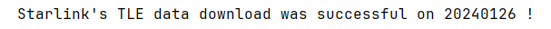
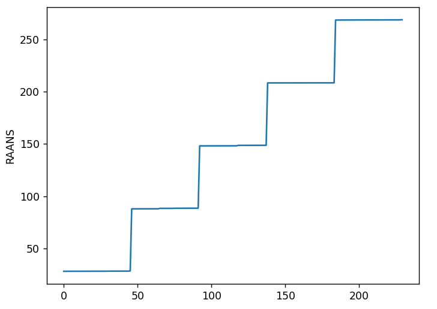
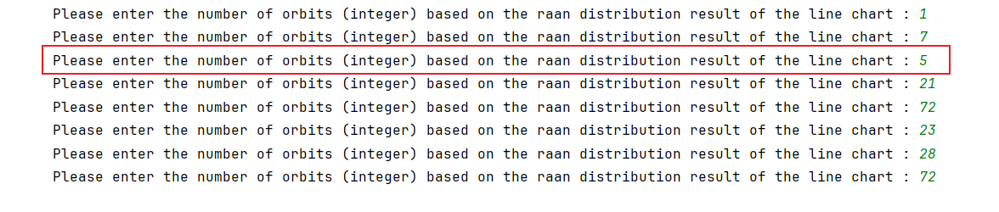
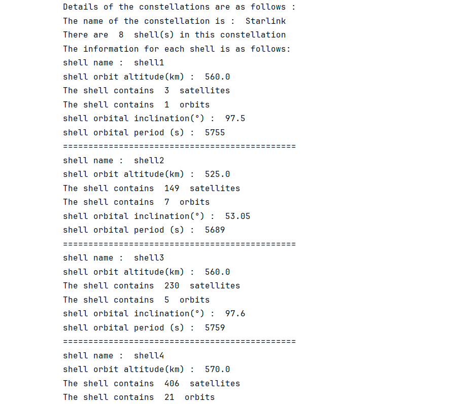

# TLE-based Constellation Generation

This method uses five scripts to complete the constellation generation: `download_TLE_data.py`, `satellite_to_shell_mapping.py`, `satellite_to_orbit_mapping.py`, `get_satellite_position.py` and `constellation_configuration.py`.

Overall, the constellation generated by this method can be divided into four stages:

- **Stage 1**: download TLE data, and this function is implemented by `download_TLE_data.py`.
- **Stage 2**: determine the shell to which the satellite belongs, and this function is implemented by `satellite_to_shell_mapping.py`.
- **Stage 3**: determine the orbit to which the satellite belongs, and this function is implemented by `satellite_to_orbit_mapping.py`.
- **Stage 4**: save the satellite position information of each timeslot to a .h5 file, and this function is implemented by `get_satellite_position.py`.

## download_TLE_data.py

This method requires the use of two types of data to construct a constellation:
1. The emission information of the constellation satellites
2. The TLE of all satellites in the constellation

### Data Sources

**First Type - Launch Information**: In StarPerf 2.0, we provide Starlink satellite launch data by default, and these data are stored at: `config/TLE_constellation/Starlink/launches.xml`.

Satellite launch data source: [https://en.wikipedia.org/wiki/List_of_Starlink_and_Starshield_launches#Launches](https://en.wikipedia.org/wiki/List_of_Starlink_and_Starshield_launches#Launches)

**Second Type - TLE Data**: It can be downloaded from here: [https://celestrak.org/NORAD/elements/](https://celestrak.org/NORAD/elements/)

### Function Parameters

The startup function of this script is `download_TLE_data`. This function only accepts one parameter, which is the constellation name of the TLE data to be downloaded.

### TLE Formats

In order to facilitate the implementation of the following functions, here we will download two types of TLE, 2LE and JSON.

#### 2LE Format

TLE data containing only two rows of elements, such as:

```
1 44713U 19074A   24025.32501904 -.00001488  00000+0 -81005-4 0  9997
2 44713  53.0536  62.8760 0001441  94.1015 266.0138 15.06396809232035
```

#### JSON Format

Parsing TLE data into JSON data, such as:

```json
{
    "OBJECT_NAME": "STARLINK-1007",
    "OBJECT_ID": "2019-074A",
    "EPOCH": "2024-01-25T07:48:01.645056",
    "MEAN_MOTION": 15.06396809,
    "ECCENTRICITY": 0.0001441,
    "INCLINATION": 53.0536,
    "RA_OF_ASC_NODE": 62.876,
    "ARG_OF_PERICENTER": 94.1015,
    "MEAN_ANOMALY": 266.0138,
    "EPHEMERIS_TYPE": 0,
    "CLASSIFICATION_TYPE": "U",
    "NORAD_CAT_ID": 44713,
    "ELEMENT_SET_NO": 999,
    "REV_AT_EPOCH": 23203,
    "BSTAR": -8.1005e-5,
    "MEAN_MOTION_DOT": -1.488e-5,
    "MEAN_MOTION_DDOT": 0
}
```

When the TLE data is downloaded successfully, the system will output prompt information on the terminal, such as:



TLE data in these two formats will eventually be saved in the `config/TLE_constellation/<constellation_name>/tle.h5` file.

**Note: When using TLE data to generate constellations, please ensure that your computer can be connected to the Internet because an Internet connection is required to download the data.**

## satellite_to_shell_mapping.py

This script establishes a corresponding relationship between each satellite described in the TLE data and the shell in which it is located, and the satellite's launch information is used to establish this relationship.

### Implementation Mechanism

In the TLE data in JSON format, there is a field named "OBJECT_ID", from which the launch batch number (COSPAR_ID) of the satellite can be obtained, combined with `config/TLE_constellation/<constellation_name>/launches.xml`, the corresponding relationship between COSPAR_ID, orbital altitude and orbital inclination can be used to infer the shell to which a satellite belongs.

### Function Parameters

The startup function of this script is `satellite_to_shell_mapping`. This function accepts only one parameter, the name of the constellation.

## satellite_to_orbit_mapping.py

Section 8.1.2.2 determines the shell to which the satellite belongs. This section is used to determine the orbit to which the satellite belongs.

### Implementation Mechanism

Sort the ascending node right ascension (raan) of all satellites in a shell, and then draw a distribution line chart of raan. The user observes the line chart and manually inputs the number of orbits. Subsequently, based on the number of orbits input by the user, we use the natural breakpoint method to divide these satellites into several orbits to determine the correspondence between satellites and orbits.

When the script is executed, the program will output (some) line charts. The user needs to observe the line charts and determine the approximate number of tracks, and enter the approximate number into the program. For example, the following figure is a line chart output during program execution:



From this line chart, we can see that there are 5 values for raan, which means there are 5 tracks, so you need to manually enter 5 in the console:



After you complete the input, the program will continue to run and use the natural breakpoint method to determine the orbit to which the satellite belongs based on the data you entered. A third-party library in Python called jenkspy has implemented the natural breakpoint method, so the jenkspy library is used here to determine the orbit to which the satellite belongs.

Regarding the principles of the natural breakpoint method, you can refer here: [https://pbpython.com/natural-breaks.html](https://pbpython.com/natural-breaks.html)

### Function Parameters

The startup function of this script is `satellite_to_orbit_mapping`. This function only accepts one parameter, which is a shell class object.

After the script is executed, the constellation has been generated.

## get_satellite_position.py

After the end of Section 8.1.2.3, the constellation has been generated. Now the position information (latitude, longitude and altitude) of each satellite needs to be saved, so the position of the satellite needs to be calculated based on TLE data.

Here we use the skyfield library to calculate the satellite's position information. The specific implementation is: input the TLE data and the time corresponding to the TLE, and the skyfield library can parse out the longitude, latitude and altitude information of the satellite.

Finally, we save the satellite position information of each timeslot into a .h5 file. The storage location of this file: `data/TLE_constellation/`.

## constellation_configuration.py

This script is used to call `download_TLE_data.py`, `satellite_to_shell_mapping.py`, `satellite_to_orbit_mapping.py` and `get_satellite_position.py` to complete the constellation initialization function.

### Function Parameters

The startup function of this script is `constellation_generation/by_TLE/constellation_configuration`.

**Table: constellation_configuration**

| Parameter Name | Parameter Type | Parameter Unit | Parameter Meaning |
| :----------------: | :------------: | :------------: | :----------------------------------------------------------: |
| dT | int | second | indicates how often timestamps are recorded, and this value must be less than the orbital period of the satellite |
| constellation_name | str | - | the name of the constellation, the value of this parameter must have the same name as the subfolder in "config/TLE_constellation/". The configuration file of the constellation named by that name is stored in a subfolder with the same name. |

When you need to use TLE data to generate a constellation, you only need to call this script to complete.

## Case Study

Now, we give an example of constellation generation using TLE data for easy understanding.

### Step 1: Define Parameters

We define the two function parameters as follows:

```python
dT = 1000
constellation_name = "Starlink"
```

### Step 2: Call the Generation Function

We call the `constellation_configuration` function to generate the constellation:

```python
# generate the constellations
constellation = constellation_configuration.constellation_configuration(dT, constellation_name)
```

### Step 3: View Results

After the above two steps, we have obtained a constellation. Now print out some basic parameter information of the constellation, as follows (part):



The complete code of the above process can be found at: `samples/TLE_constellation/constellation_generation/constellation_generation_test.py`.

## Navigation

- [Back to Constellation Generation Overview](overview.md)
- [Previous: XML-based Generation](xml-based.md)
- [Next: Duration-based Generation](duration-based.md)
