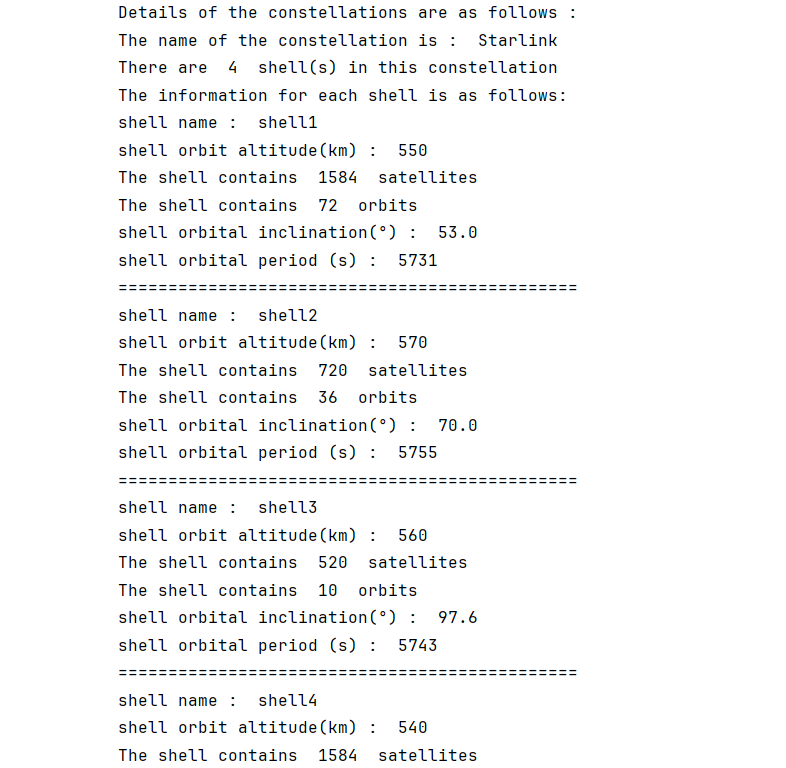

# XML-based Constellation Generation

This method uses two scripts to complete the constellation generation: `constellation_generation/by_XML/constellation_configuration.py` and `constellation_generation/by_XML/orbit_configuration.py`. After these two scripts are executed, the constellation is generated.

## constellation_configuration.py

The startup function of this script is `constellation_configuration`.

### Function Parameters

**Table: constellation_configuration information**

| Parameter Name | Parameter Type | Parameter Unit | Parameter Meaning |
| :----------------: | :------------: | :------------: | :----------------------------------------------------------: |
| dT | int | second | indicates how often timestamps are recorded, and this value must be less than the orbital period of the satellite |
| constellation_name | str | - | the name of the constellation, and the value of this parameter must have the same name as an xml file in "config/XML_constellation". The xml file with the same name is the configuration file of the constellation named with that name |

### Execution Process

When executing the function `constellation_configuration`, the xml file under the "config/XML_constellation/" path will be loaded according to the parameter "constellation_name", that is:

```python
xml_file_path = "config/XML_constellation/" + constellation_name + ".xml"
```

Afterwards, each shell of the constellation will be generated based on the xml data. Generating each shell consists of two stages.

#### Stage 1: Generating Basic Parameters

Generating the basic parameters of the shell, such as orbital altitude, orbital period, orbital inclination, number of orbits, number of satellites in each orbit, etc. This stage can be completed directly using xml data.

#### Stage 2: Generating Orbits and Satellites

Generating orbits and satellites in the shell. This stage is implemented by two Python third-party libraries, skyfield and sgp4. The specific implementation of this part is in `orbit_configuration.py`. You only need to just call this script in `constellation_configuration.py`.

After the completion of these two stages, the target constellation initialization task has been completed. At this time, the position information of each satellite in the constellation at each moment is saved in an h5 file under "data/XML_constellation".

**Note: The number of constellation moments is determined by the parameter dT and the orbital period. That is, a total of `(int)(orbit_cycle / dT)` satellite position data needs to be saved to the h5 file.**

Finally, the return value of this function represents the generated constellation, which is a constellation object.

## orbit_configuration.py

The startup function of this script is `constellation_generation/by_XML/orbit_configuration`.

### Function Parameters

**Table: orbit_configuration information**

| Parameter Name | Parameter Type | Parameter Unit | Parameter Meaning |
| :------------: | :------------: | :------------: | :----------------------------------------------------------: |
| dT | int | second | indicates how often timestamps are recorded, and this value must be less than the orbital period of the satellite |
| sh | shell | - | shell to generate orbits and satellites |

### Execution Process

When this function is executed, the system will generate the Kepler parameters of each orbit based on the existing parameters of "sh" (number of orbits, orbital inclination, number of satellites in each orbit, etc.). Then, in-orbit satellites are generated based on the generated orbits. This process uses the skyfield and sgp4 libraries.

This function is called by `constellation_configuration.py` and is responsible for completing the functions of **Stage 2** described above. Therefore, this function has no return value. After execution, continue to execute `constellation_configuration.py`.

## Case Study

Now, we give an example of Walker-δ constellation generation and initialization to facilitate your understanding.

### Step 1: Define Parameters

We define the two function parameters as follows:

```python
dT = 5730
constellation_name = "Starlink"
```

### Step 2: Call the Generation Function

We call the `constellation_configuration` function to generate the constellation:

```python
# generate the constellations
constellation = constellation_configuration.constellation_configuration(
    dT=dT,
    constellation_name=constellation_name
)
```

### Step 3: View Results

After the above two steps, we have obtained a constellation. Now print out some basic parameter information of the constellation, as follows (part):



The complete code of the above process can be found at: `samples/XML_constellation/constellation_generation/constellation_generation_test.py`.

## Navigation

- [Back to Constellation Generation Overview](overview.md)
- [Next: TLE-based Generation](tle-based.md)
- [Duration-based Generation](duration-based.md)
