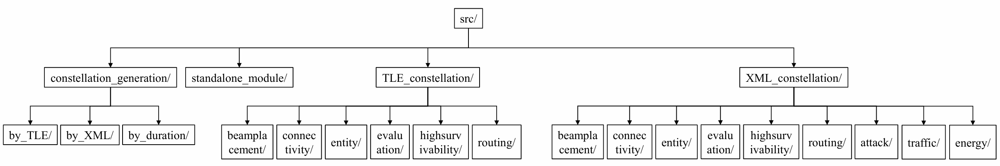

# Kernel Module: src/

This module is the kernel code module of StarPerf 2.0, which stores the system's "framework + plug-in". The architecture of this module is as follows:

## Module Overview

The function of each module in the above figure are as follows:

**Table: Kernel Module Submodules and Functions**

| Module | Function |
| :-----------------------: | :----------------------------------------------------------: |
| constellation_generation/ | part of the "framework" that implements constellation generation and constellation initialization. |
| standalone_module/ | Provide some independent function modules, such as calculating the length of satellite time that users can see. |
| TLE_constellation/ | Construct constellations using TLE data. |
| XML_constellation/ | Construct constellations using XML data. |

## Core Functional Modules

The core functional modules available for both XML and TLE constellations are shown in the following table:

**Table: Core Functional Modules and Functions**

| Module | Function |
| :----------------: | :----------------------------------------------------------: |
| beamplacement/ | **constellation_beamplacement**: implement part of the "framework" related to beam placement, as well as plug-ins related to beam placement algorithms. |
| connectivity/ | **constellation_connectivity**: implements parts of the "framework" related to the connectivity mode between satellites in the constellation, as well as plug-ins for the connectivity mode. |
| evaluation/ | **constellation_evaluation**: implement part of the "framework" related to constellation performance evaluation, such as delay, bandwidth, coverage, etc. |
| entity/ | **constellation_entity**: the entity classes in StarPerf 2.0 are defined, such as orbit, satellite, ground stations, etc., and this module is part of the "framework". |
| highsurvivability/ | **constellation_highsurvivability**: implement part of the "framework" related to the high survivability aspect of the constellation, as well as some constellation damage model plug-ins. |
| routing/ | **constellation_routing**: implements part of the "framework" for constellation routing, as well as some routing strategy plug-ins. |
| traffic/ | **constellation_traffic**: implements part of the "framework" for traffic generation, as well as traffic model plug-ins. |
| energy/ | **constellation_energy**: implements part of the "framework" for energy consumption modeling, as well as energy model plug-ins. |
| attack/ | **constellation_attack**: implements part of the "framework" for attack simulation, as well as attack model plug-ins. |

## Navigation

- [Constellation Generation](constellation-generation/overview.md)
- [Standalone Modules](standalone-modules/satellite-visibility.md)
- [Beam Placement](beam-placement/overview.md)
- [Connectivity](connectivity/overview.md)
- [Evaluation](evaluation/overview.md)
