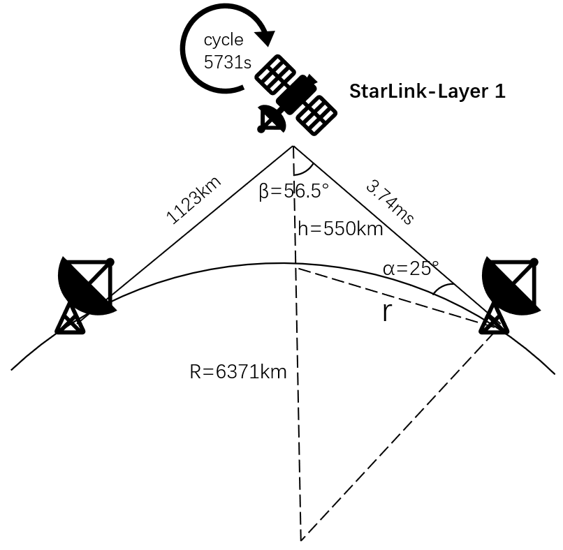
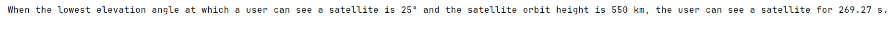

# Standalone Modules

This module is used to implement some relatively independent functions and can be used by users as needed.

## Satellite Visible Time Calculation

In some cases, it may be necessary to calculate the time a satellite is visible to the user. For example, we need to calculate how long the satellite can be observed by ground users in the scenario shown in the figure below:



This is a simple geometric calculation function implemented by `src/standalone_module/satellite_visibility_time.py`.

### Function Parameters

The startup function of this script is `satellite_visibility_time`.

**Table: satellite_visibility_time**

| Parameter Name | Parameter Type | Parameter Unit | Parameter Meaning |
| :------------: | :------------: | :------------: | :----------------------------------------------------------: |
| θ | float | degree | the lowest elevation angle at which the user can see the satellite |
| h | float | km | the height of a satellite's orbit above the earth's surface |

### Implementation

This function performs a geometric calculation based on the satellite's orbital height and the minimum elevation angle at which a ground user can observe the satellite. It returns the duration for which the satellite remains visible to the ground user.

The calculation takes into account:
- The Earth's radius
- The satellite's orbital altitude
- The minimum elevation angle constraint
- The satellite's orbital velocity

## Case Study

Now, we give an example of calculating the satellite time visible to ground users for easier understanding:

### Example Code

```python
satellite_visibility_time(θ=25, h=550)
```

### Results

The results of executing the above code are as follows:



The complete code of the above process can be found at: `samples/standalone_module/standalone_module_test_cases.py`.

## Use Cases

The satellite visibility time calculation is useful for:

1. **Coverage Analysis**: Understanding how long users in different locations can maintain connectivity
2. **Handover Planning**: Determining when satellite handovers need to occur
3. **Link Budget Calculations**: Estimating available communication windows
4. **QoS Guarantees**: Evaluating service availability for different user locations

## Mathematical Background

The visibility time depends on several geometric factors:

- **Elevation Angle (θ)**: Lower elevation angles provide longer visibility but suffer from atmospheric effects and potential obstructions
- **Orbital Height (h)**: Higher satellites are visible for longer periods but have longer propagation delays
- **Earth's Geometry**: The spherical nature of Earth limits the maximum possible visibility time

## Navigation

- [Back to Core Modules Overview](../overview.md)
- [Constellation Generation Overview](../constellation-generation/overview.md)
