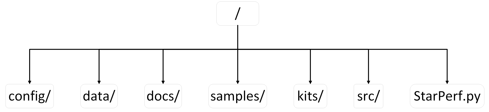

# Architecture

The first-level architecture of StarPerf 2.0 is as follows:

## Module Overview

The functions of each first-level module in the above figure are as follows:

**Table 2: StarPerf 2.0 first-level modules and functions**

|   Module    |                           Function                           |
| :---------: | :----------------------------------------------------------: |
|   config/   | **Configuration Information Module**, is used to store configuration files, such as constellation configuration information, ground station information, etc. |
|    data/    | **Data Storage Module**, is used to store preloaded data and intermediate data and result data generated during system operation, such as cells of different resolutions in the h3 library, satellite position data, etc. |
|    docs/    | **Documentation Module**, is used to store various documentation, pictures, and dependent library information of StarPerf 2.0, such as this document, the list of third-party Python libraries that the system depends on. |
|  samples/   | **Test Sample Module**, is used to store test case scripts for each functional module, and these scripts are independent of each other and can be directly called and run. |
|    kits/    | **Auxiliary Script Module**, is used to store some auxiliary scripts written to complete system functions, such as ".xlsx" file conversion ".xml" file scripts, etc. |
|    src/     | **Kernel Module**, is the core module of StarPerf 2.0, which contains all the core code of each functional module. The "framework + plug-in" architecture mentioned earlier is this module. |
| StarPerf.py | **StarPerf 2.0 Startup Script**, users should start StarPerf 2.0 from this script. |

---

**Navigation:**
- [Previous: Environment & Dependencies](environment.md)
- [Next: Configuration](configuration.md)
