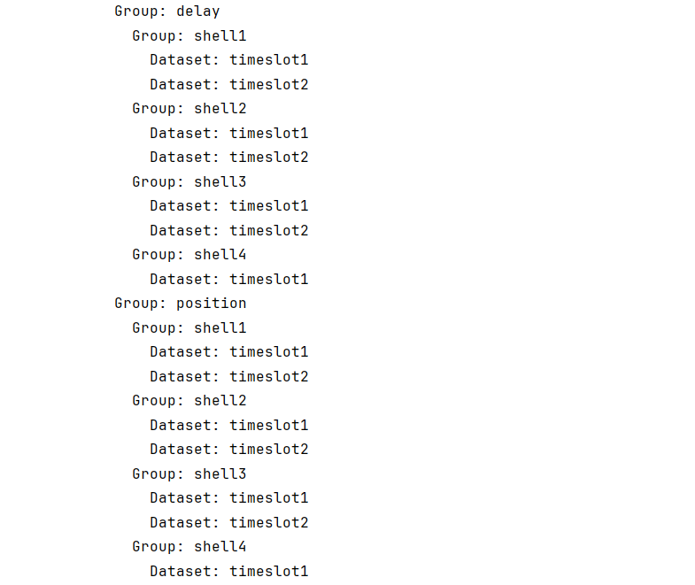
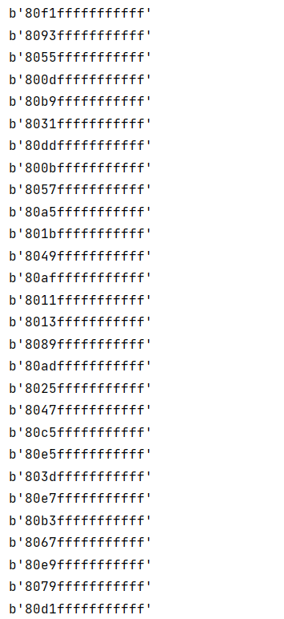

# Auxiliary Script Module: kits/

This module stores some auxiliary scripts written to complete the core functions of StarPerf 2.0, such as file format conversion scripts, h5 file reading scripts, etc.

## Viewing h5 File Tree Structure

If you want to view the tree structure of an h5 file, you can run `get_h5file_tree_structure.py`. This script will read `data/XML_constellation/Starlink.h5` and display the group and dataset information in it.

The script execution results are as follows:

**Explanation of execution results:** The above figure shows that `data/XML_constellation/Starlink.h5` contains 2 first-level groups: position and delay, which represent satellite position data and constellation delay matrix data respectively. Each first-level group contains 4 second-level groups, which represent each layer of shell data. Each secondary group contains 2 datasets, representing the data of two timestamps.

## Viewing h3 Cell IDs

If you want to view the h3id of all cells at the specified resolution in `data/h3_cells_id_res0-4.h5`, you can execute `print_h3_cells_h3id.py`.

Assume that you now want to view the h3id of all cells with a resolution of 0, part of the execution results of this script are as follows:

**Explanation of execution results:** Each row in the above figure represents the h3id of a cell with a resolution of 0. Due to space limitations, only part of the execution results are shown here. More detailed results can be viewed by executing the script.

## Other Utility Scripts

The `kits/` directory may contain additional utility scripts for:
- File format conversion (e.g., `.xlsx` to `.xml`)
- Data preprocessing
- Configuration validation
- Testing and debugging tools

---

**Navigation:**
- [Previous: Data Storage](data-storage.md)
- [Next: Core Modules](../core-modules/README.md)
