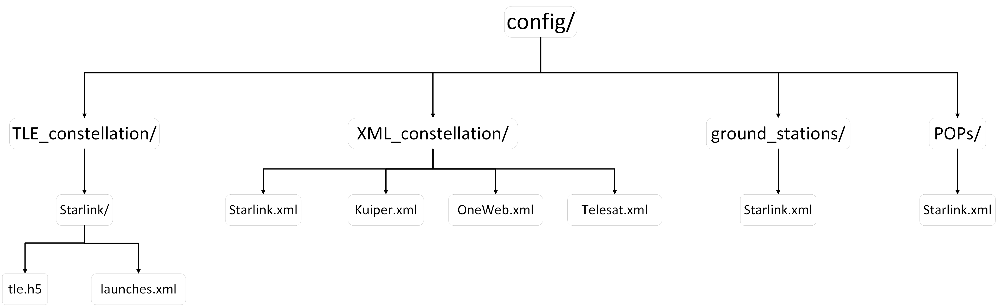
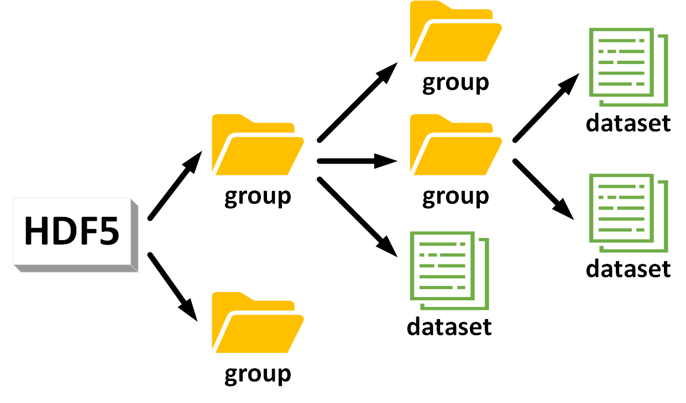
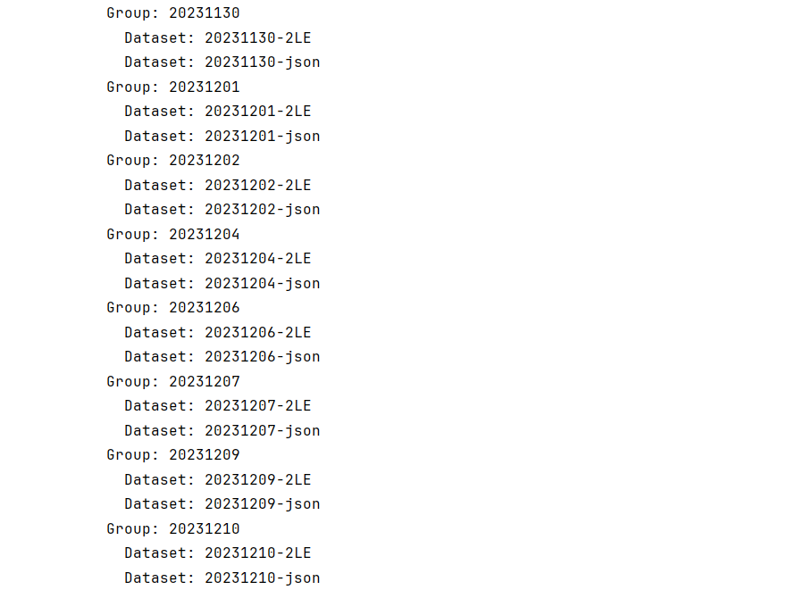

# Configuration Information Module: config/

This module stores all data information related to constellation configuration in StarPerf 2.0, and the structure diagram of this module is as follows:



## Module Overview

The functions of each module in the above figure are as follows:

**Table 3: config module**

| Module             | Function                                                     |
| ------------------ | ------------------------------------------------------------ |
| TLE_constellation/ | Stores the data information required to generate constellations using TLE. Each constellation is described by a TLE data file (.h5) and a launch batch information file (.xml). |
| XML_constellation/ | Stores the data information required to generate constellations using XML data. Each constellation is described by an .xml file. |
| ground_stations/   | Stores the ground station data of the constellation. All ground station information for each constellation is described by an .xml file. |
| POPs/              | Store the POP points data of the constellation. All POP points information for each constellation is described by an .xml file. |

## h5 File Introduction

This format file is generally used to store scientific data. It has a structure similar to a "file directory" and allows the data in the file to be organized in many different structured ways, just like working with files on a computer.

There are two main structures in h5 files: **group** and **dataset**. An h5 file is a combination of several groups and datasets.

- **group**: A grouping structure containing 0 or more instances of a dataset or group, along with supporting metadata.
- **dataset**: A data collection organized in an array-like manner, working like a numpy array, a dataset is a numpy.ndarray. The specific dataset can be images, tables, or even pdf files and excel.

Working with groups and datasets is in many ways similar to working with directories and files in UNIX. Like UNIX directories and files, objects in h5 files are usually described by providing full (or absolute) pathnames.



Reading and writing h5 files can be completed through Python's h5py library. For specific usage, see `kits/`.

## TLE_constellation/

This folder stores the data information of the constellation generated by TLE. Each constellation is described by a folder named after the constellation. There are two files in this folder, one is the .h5 file that stores TLE, and the other is the .xml file that stores satellite launch information.

In the .h5 file that stores TLE, each day's TLE data is a Group, and the Group name is the date of the day. Each Group contains two Datasets. The first Dataset is a TLE containing two rows of information, and the second Dataset is a TLE in JSON format.

For example, the tree structure of the `config/TLE_constellation/Starlink/tle.h5` file is as shown below:



### Launch Information XML Structure

The structure of the .xml file that stores satellite launch information is as follows:

```xml
<Launches>
  <Launch1>
    <COSPAR_ID>2019-074</COSPAR_ID>
    <Altitude>550</Altitude>
    <Inclination>53</Inclination>
  </Launch1>
  ......
</Launches>
```

The root element of the xml file is "Launches". The root element contains several elements, each element is named with "Launch+\<number>" (such as "Launch1", "Launch2", etc.), which is used to represent a satellite launch information.

Each launch contains three types of information:
- [COSPAR_ID](https://en.wikipedia.org/wiki/International_Designator#:~:text=The%20International%20Designator%2C%20also%20known%20as%20COSPAR%20ID%2C,sequential%20identifier%20of%20a%20piece%20in%20a%20launch.)
- Orbit altitude Altitude (unit: kilometers)
- Orbit inclination (unit: °)

## XML_constellation/

This folder stores the data information of the constellation generated by XML. Walker-δ constellations and polar constellations can be generated using XML files. In this way of generating constellations, each constellation only requires a .xml configuration information file, and no TLE is required.

Taking Starlink as an example, the .xml configuration information file of the constellation is `config/XML_constellation/Starlink.xml`. The content of the file is as follows:

```xml
<constellation>
    <number_of_shells>4</number_of_shells>
    <shell1>
        <altitude>550</altitude>
        <orbit_cycle>5731</orbit_cycle>
        <inclination>53.0</inclination>
        <phase_shift>1</phase_shift>
        <number_of_orbit>72</number_of_orbit>
        <number_of_satellite_per_orbit>22</number_of_satellite_per_orbit>
    </shell1>
    ......
</constellation>
```

The root element of the document is `<constellation>`. The first sub-element inside the root element is `<number_of_shells>`, which represents the number of shells in the constellation.

In this example, we assume that the value is 4, then there will be 4 sub-elements under the root element `<shell1>` `<shell2>`...`<shell4>`, representing different shells respectively.

There are 6 sub-elements inside each shell, representing:
- Orbital altitude (unit: km)
- Orbital period (unit: s)
- Orbital inclination (unit: °)
- Phase shift
- Number of orbits
- Number of satellites in each orbit

## ground_stations/

This folder stores the ground station information of the constellation. The ground station information of each constellation is described by an .xml file named after the constellation name.

The content of Starlink's ground station information file `config/ground_stations/Starlink.xml` is as follows:

```xml
<GSs>
  <GS1>
    <Latitude>-12.74832</Latitude>
    <Longitude>-38.28305</Longitude>
    <Description>Camaçari, BR</Description>
    <Frequency>Ka</Frequency>
    <Antenna_Count>8</Antenna_Count>
    <Uplink_Ghz>2.1</Uplink_Ghz>
    <Downlink_Ghz>1.3</Downlink_Ghz>
  </GS1>
  ......
</GSs>
```

The root element of the document is `<GSs>`. In this example, we assume that there are 10 ground stations, then there will be 10 sub-elements under the root element `<GS1>` `<GS2>`...`<GS10>`, representing different ground stations respectively.

There are 7 sub-elements inside each GS, representing:
- Ground station latitude
- Ground station longitude
- Ground station location description
- Ground station frequency
- Ground station antenna count
- Ground station uplink (GHz)
- Ground station downlink (GHz)

## POPs/

This folder stores the POP information of the constellation. The POP information of each constellation is described by an .xml file named after the constellation name.

The content of Starlink's POP information file `config/POPs/Starlink.xml` is as follows:

```xml
<POPs>
  <POP1>
    <Latitude>47.6048790423666</Latitude>
    <Longitude>-122.333542912036</Longitude>
    <Name>SEA - STTLWAX1</Name>
  </POP1>
  ......
</POPs>
```

The root element of the document is `<POPs>`. In this example, we assume that there are 10 POPs, then there will be 10 sub-elements under the root element `<POP1>` `<POP2>`...`<POP10>`, representing different POPs respectively.

There are 3 sub-elements inside each POP, representing:
- POP latitude
- POP longitude
- POP name

---

**Navigation:**
- [Previous: Architecture](architecture.md)
- [Next: Data Storage](data-storage.md)
