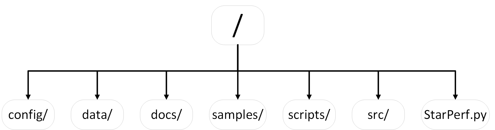
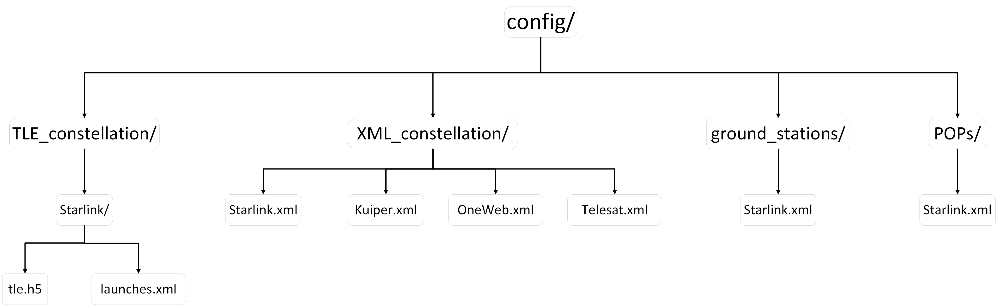
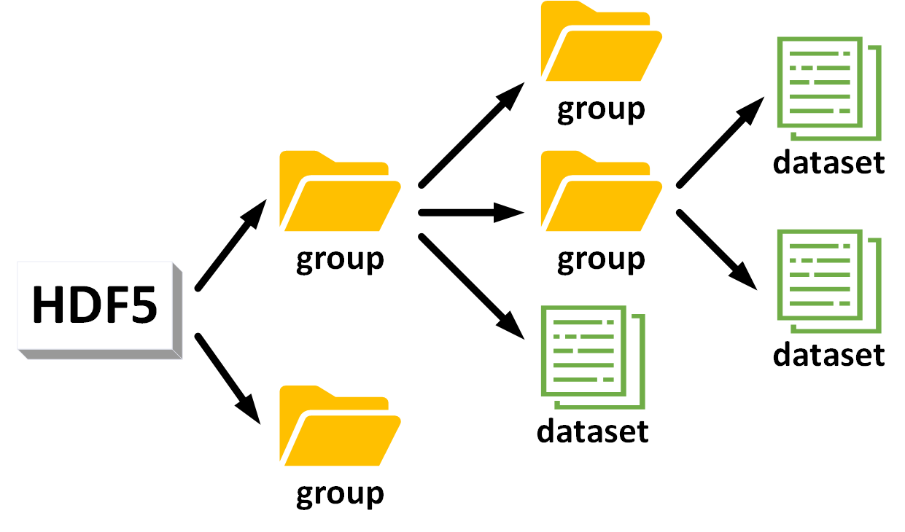
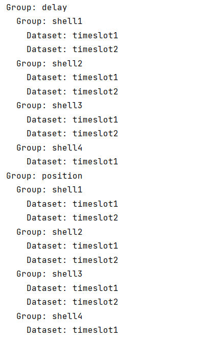
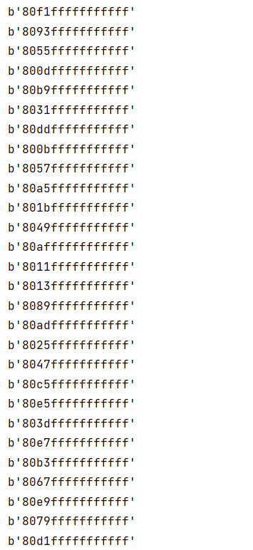
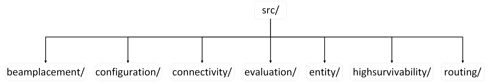
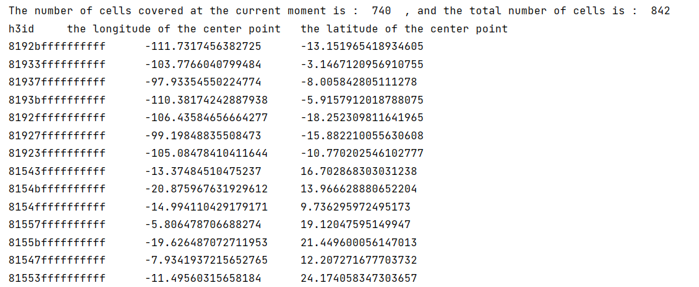
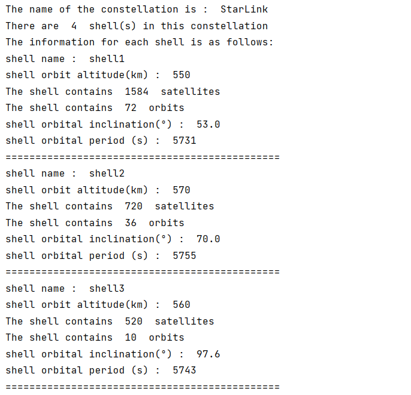

# 1. Introduction

StarPerf 2.0 is a feature-rich, highly open, and easily extensible constellation performance simulation platform. The platform architecture is 

**<span style='color:red;font-size:40px;'>"framework + plug-in"</span>**

that is: we have built a basic framework, which is used to implement various underlying functions of StarPerf 2.0 and provides a unified programming interface API to the outside. Various specific functions of the platform exist in the form of plug-ins, which are written based on the API provided by the framework. In this system, plug-ins and framework are decoupled, so StarPerf 2.0 is highly open and easily expandable.

StarPerf 2.0 supports two ways to build a constellation: the first way is to use XML configuration files to build a Walker-δ constellation, and the second way is to use TLE data to build a real constellation (Starlink, etc.).

Currently, we have provided a variety of functional plug-ins, such as the constellation connectivity mode plug-in "+Grid", the constellation routing strategy plug-in "Shortest Path Routing", the constellation high survival simulation plug-in "Solar Storm Damage Model", etc. 

Of course, you can also write the functional plug-ins you are interested in based on the interface API provided by the framework to achieve personalized functions. The remainder of this document is used to introduce various API interface specifications provided by the framework so that you can better use StarPerf 2.0 to complete your simulation tasks.

# 2. Environment & Dependencies

<a id="EnvironmentAndDependencies"></a>

Before we begin, we first introduce the operating environment of StarPerf 2.0 and its dependent libraries so that you can install StarPerf 2.0 correctly.

It is developed based on Python 3.10, so we recommend that your **Python version is ≥3.10**. In addition to the Python 3.10 standard library, it also uses the following open source Python third-party libraries:

**Table 1 : third-party Python libraries and versions**

|      Library       | Version |
| :----------------: | :-----: |
|         h3         | 4.0.0b2 |
|        h5py        | 3.10.0  |
|       numpy        | 1.24.4  |
|      openpyxl      |  3.1.2  |
| importlib-metadata |  6.8.0  |
|      skyfield      |  1.46   |
|        sgp4        |  2.22   |
|       pandas       |  2.1.0  |
|     poliastro      | 0.17.0  |
|      astropy       |  5.3.3  |
|      networkx      |   3.1   |
|      requests      | 2.31.0  |
|      jenkspy       |  0.4.0  |
|     pyecharts      |  2.0.4  |

The third-party Python libraries in the above table and their corresponding version numbers are all listed in "docs/third-party_libraries_list.txt" in the form of "LibraryName==LibraryVersion" (such as "numpy==1.24.4"), and you can execute the 

**<span style='color:red;font-size:20px;'>"pip install -r docs/third-party_libraries_list.txt"</span>** 

command in the root directory of the StarPerf 2.0 project to install all third-party Python libraries at once.

Finally, StarPerf 2.0 does not depend on any non-Python environment, so you do not need to install any third-party orbit analysis/calculation tools (STK, etc.).

# 3. Architecture

The first-level architecture of StarPerf 2.0 is as follows :



The functions of each first-level module in the above figure are as follows : 

**Table 2 : StarPerf 2.0 first-level modules and functions**

| Module      | Function                                                                                                                                                                                                                   |
|:-----------:|:--------------------------------------------------------------------------------------------------------------------------------------------------------------------------------------------------------------------------:|
| config/     | **Configuration Information Module**, is used to store configuration files, such as constellation configuration information, ground station information, etc.                                                              |
| data/       | **Data Storage Module**, is used to store preloaded data and intermediate data and result data generated during system operation, such as cells of different resolutions in the h3 library, satellite position data, etc.  |
| docs/       | **Documentation Module**, is used to store various documentation, pictures, and dependent library information of StarPerf 2.0, such as this document, the list of third-party Python libraries that the system depends on. |
| samples/    | **Test Sample Module**, is used to store test case scripts for each functional module, and these scripts are independent of each other and can be directly called and run.                                                 |
| scripts/    | **Auxiliary Script Module**, is used to store some auxiliary scripts written to complete system functions, such as ".xlsx" file conversion ".xml" file scripts, etc.                                                       |
| src/        | **Kernel Module**, is the core module of StarPerf 2.0, which contains all the core code of each functional module. The "framework + plug-in" architecture mentioned earlier is this module.                                |
| StarPerf.py | **StarPerf 2.0 Startup Script**, users should start StarPerf 2.0 from this script.                                                                                                                                         |

# 4. Configuration Information Module : config/

This module stores all data information related to constellation configuration in StarPerf 2.0, and the structure diagram of this module is as follows:



The functions of each module in the above figure are as follows : 

**Table 3 : config module**

| Module             | Function                                                     |
| ------------------ | ------------------------------------------------------------ |
| TLE_constellation/ | Stores the data information required to generate constellations using TLE. Each constellation is described by a TLE data file (.h5) and a launch batch information file (.xml). |
| XML_constellation/ | Stores the data information required to generate constellations using XML data. Each constellation is described by an .xml file. |
| ground_stations/   | Stores the ground station data of the constellation. All ground station information for each constellation is described by an .xml file. |
| POPs/              | Store the POP points data of the constellation. All POP points information for each constellation is described by an .xml file. |

**TLE_constellation/  ** : 


Let's take the two configuration information files of StarLink as an example to illustrate.

Firstly, we explain the configuration information file of StarLink: "StarLink.xml". The format of this file is as follows:

```xml
<constellation>
    <number_of_shells>4</number_of_shells>
    <shell1>
        <altitude>550</altitude>
        <orbit_cycle>5731</orbit_cycle>
        <inclination>53.0</inclination>
        <phase_shift>1</phase_shift>
        <number_of_orbit>72</number_of_orbit>
        <number_of_satellite_per_orbit>22</number_of_satellite_per_orbit>
    </shell1>
    ......
</constellation>
```

The root element of the document is "\<constellation>". The first sub-element inside the root element is "\<number_of_shells>", which represents the number of shells in the constellation. In this example, we assume that the value is 4, then there will be 4 sub-elements under the root element "\<shell1>" "\<shell2>"..."\<shell4>", representing different shells respectively. There are 6 sub-elements inside each shell, representing orbital altitude (unit: km), orbital period (unit: s), orbital inclination (unit: °), phase shift, number of orbits and number of satellites in each orbit. 

Then, we explain the StarLink ground station situation. These data are located in "StarLink_GSs.xml". The specific information is:

```xml
<GSs>
  <GS1>
    <Latitude>-12.74832</Latitude>
    <Longitude>-38.28305</Longitude>
    <Description>Camaçari, BR</Description>
    <Frequency>Ka</Frequency>
    <Antenna_Count>8</Antenna_Count>
    <Uplink_Ghz>2.1</Uplink_Ghz>
    <Downlink_Ghz>1.3</Downlink_Ghz>
  </GS1>
  ......
</GSs>
```

The root element of the document is "\<GSs>". In this example, we assume that there are 10 ground station, then there will be 10 sub-elements under the root element "\<GS1>" "\<GS2>"..."\<GS10>", representing different ground station respectively. There are 7 sub-elements inside each GS, representing ground station latitude, ground station longitude, ground station location description, ground station frequency, ground station antenna count, ground station uplink(GHz) and ground station downlink(GHz).

We provide StarLink configuration information by default in StarPerf 2.0. If necessary, you can also write your own constellation configuration information according to the above document format, then name the document after your constellation name and place the document under "config/constellation_configuration/". When using StarPerf 2.0 to simulate your own constellation, you only need to inform the system of the constellation name, and the system will automatically load your constellation configuration information to the above location.

# 5. Data Storage Module : data/

This module stores various data when StarPerf 2.0 is running, which can be divided into three categories :

- **Preloaded data** : the data that StarPerf 2.0 must read when running certain functions, such as the data of Uber h3 library cells, which is located in "h3_cells_id_res0-4.h5".
- **Intermediate data** : StarPerf 2.0 needs to temporarily store some data when running certain functions, such as the delay matrix of the constellation, satellite position data, etc. These data are stored in "\<constellation\_name>.h5"  (such as "StarLink.h5").
- **Result data** : the final results produced after StarPerf 2.0 runs, such as some output drawings in pdf format, etc.

## 5.1 h5 file introduction

This format file is generally used to store scientific data. It has a structure similar to a "file directory" and allows the data in the file to be organized in many different structured ways, just like working with files on a computer. 

There are two main structures in h5 files: **group** and **dataset**. An h5 file is a combination of several groups and datasets.

- **group** : A grouping structure containing 0 or more instances of a dataset or group, along with supporting metadata.
- **dataset** : A data collection organized in an array-like manner, working like a numpy array, a dataset is a numpy.ndarray. The specific dataset can be images, tables, or even pdf files and excel.

Working with groups and datasets is in many ways similar to working with directories and files in UNIX. Like UNIX directories and files, objects in h5 files are usually described by providing full (or absolute) pathnames.



Reading and writing h5 files can be completed through Python's h5py library. For specific usage, see "scripts/".

# 6. Documentation Module : docs/

Stored under this module are various documentation related to StarPerf 2.0. For example, this document exists under this module, and all illustrations referenced in this document also exist under this module.

In addition, there is an important file under this module: "third-party_libraries_list.txt". This file describes all third-party Python libraries and versions that StarPerf 2.0 depends on. Please refer to the **"[Environment & Dependencies](#EnvironmentAndDependencies)"** chapter for the specific usage of this document, which will not be described again here.

# 7. Auxiliary Script Module : scripts/

This module stores some auxiliary scripts written to complete the core functions of StarPerf 2.0, such as file format conversion scripts, h5 file reading scripts, etc.

For example, if you want to view the tree structure of an h5 file, you can run "get_h5file_tree_structure.py". This script will read "StarLink.h5" and display the group and dataset information in it. The script execution results are as follows:



Explanation of execution results: the above figure shows that "StarLink.h5" contains 2 first-level groups: position and delay, which represent satellite position data and constellation delay matrix data respectively. Each first-level group contains 4 second-level groups, which represent each layer of shell data. Each secondary group contains 2 datasets, representing the data of two timestamps.

For another example, if you want to view the h3id of all cells at the specified resolution in "data/h3_cells_id_res0-4.h5", you can execute "print_h3_cells_h3id.py". Assume that you now want to view the h3id of all cells with a resolution of 0, part of the execution results of this script are as follows:



Explanation of execution results: each row in the above figure represents the h3id of a cell with a resolution of 0. Due to space limitations, only part of the execution results are shown here. More detailed results can be viewed by executing the script.

# 8. Kernel Module : src/

This module is the kernel code module of StarPerf 2.0, which stores the system's "framework + plug-in". The architecture of this module is as follows:



The functions of each module in the above figure are as follows : 

**Table 3 : kernel module submodules and functions**

| Module             | Function                                                                                                                                                                                       |
|:------------------:|:----------------------------------------------------------------------------------------------------------------------------------------------------------------------------------------------:|
| beamplacement/     | **constellation\_beamplacement** : implement part of the "framework" related to beam placement, as well as plug-ins related to beam placement algorithms.                                      |
| configuration/     | **constellation\_configuration** : part of the "framework" that implements constellation generation and constellation initialization.                                                          |
| connectivity/      | **constellation\_connectivity** : implements parts of the "framework" related to the connectivity mode between satellites in the constellation, as well as plug-ins for the connectivity mode. |
| evaluation/        | **constellation\_evaluation** : implement part of the "framework" related to constellation performance evaluation, such as delay, bandwidth, coverage, etc.                                    |
| entity/            | **constellation\_entity** : the entity classes in StarPerf 2.0 are defined, such as orbit, satellite, ground stations, etc., and this module is part of the "framework".                       |
| highsurvivability/ | **constellation\_highsurvivability** : implement part of the "framework" related to the high survivability aspect of the constellation, as well as some constellation damage model plug-ins.   |
| routing/           | **constellation\_routing** : implements part of the "framework" for constellation routing, as well as some routing strategy plug-ins.                                                          |

## 8.1 constellation\_beamplacement

This part includes two aspects. One is  "framework" part : beam placement plug-in manager, another is the "plug-in" part : various beam placement algorithms. After explaining these two parts, we give a case study so that you can better understand the working mechanism of this module.

### 8.1.1 Plug-ins

All plug-ins under this module are beam placement algorithms, and one plug-in represents a beam placement algorithm. We implement the random beam placement algorithm(i.e. "**random_placement.py**") by default, and you can write other beam placement algorithm plug-ins by yourself according to the interface specifications. The interface specifications for this part are as follows:

- **Requirement 1** : The storage location of the plug-in is (starting from the root of StarPerf 2.0) : "src/constellation\_beamplacement/beam\_placement\_plugin".
- **Requirement 2** : Each plug-in is a ".py" file, and all source code for the plug-in must be located in this script file.
- **Requirement 3** : The launch entry for a plug-in is a function with the same name as the plug-in.
- **Requirement 4** : The startup function parameter requirements are as follows : 

**Table 4 : beam placement plug-in startup function parameter list**

| Parameter Name              | Parameter Type | Parameter Unit | Parameter Meaning                                                                                               |
|:---------------------------:|:--------------:|:--------------:|:---------------------------------------------------------------------------------------------------------------:|
| sh                          | shell          | -              | a shell class object, representing a layer of shell in the constellation                                        |
| h3\_resolution              | int            | -              | the resolution of cells divided by h3 library, and currently supported resolutions are: 0/1/2/3/4               |
| antenna_count_per_satellite | int            | -              | the number of antennas each satellite is equipped with                                                          |
| dT                          | int            | second         | indicates how often the beam is scheduled, and this value must be less than the orbital period of the satellite |
| minimum_elevation           | float          | degree         | the minimum elevation angle at which a satellite can be seen from a point on the ground                         |

- **Requirement 5** : The return value of the startup function is all cells covered after executing the beam placement algorithm.
- **Requirement 6** : If one plug-in needs to save intermediate data or result data, the data should be saved in an h5 format file under "data/".

### 8.1.2 Framework

This part of the framework consists of 1 py script: "**beam\_placement\_plugin\_manager.py**". A beam placement plug-in manager is defined in this script to manage all plug-ins under this module. 

The so-called beam placement plug-in manager actually defines a class named "beam\_placement\_plugin\_manager". The attributes and methods contained in this class and their functions and meanings are shown in the tables below.

**Table 5 : beam placement plug-in manager attributes list**

| Attribute Name                 | Attribute Type | Attribute Meaning                                                                                                                                                                               |
|:------------------------------:|:--------------:|:-----------------------------------------------------------------------------------------------------------------------------------------------------------------------------------------------:|
| plugins                        | dict           | a dictionary composed of all plug-ins. The "key" is the plug-in name, which is a string type, and the "value" is the plug-in startup function in the corresponding plug-in, which is a function |
| current\_beamplacement\_policy | str            | plug-in name used by the current beam placement plug-in manager                                                                                                                                 |

**Table 6 : beam placement plug-in manager methods list**

| Method Name                    | Parameter List<br />(name : type : unit)                                                                                                                | Return Values                        | Method Function                                                                                                                                                              |
|:------------------------------:|:-------------------------------------------------------------------------------------------------------------------------------------------------------:|:------------------------------------:|:----------------------------------------------------------------------------------------------------------------------------------------------------------------------------:|
| \_\_init\_\_                   | -                                                                                                                                                       | -                                    | initialize an instance of the beam placement plugin manager                                                                                                                  |
| set\_beamplacement\_policy     | (plugin\_name : str : -)                                                                                                                                | -                                    | set the value of current\_beamplacement\_policy to plugin\_name                                                                                                              |
| execute\_beamplacement\_policy | (sh : shell : - , <br />h3_resolution : int : - , antenna_count_per_satellite : int : - , <br />dT : int : second , minimum_elevation : float : degree) | cells covered by the beam, all cells | according to the value of the current\_beamplacement\_policy attribute, the startup function of the corresponding plug-in is called to execute the beam placement algorithm. |

The operating mechanism of this framework is: first instantiate a beam placement plug-in manager object. This object contains two attributes: "plugins" and "current\_beamplacement\_policy". "plugins" is a dictionary type attribute used to store various beam placement plugins. "current\_beamplacement\_policy" is a string type used to represent the beam placement plugin used by the current manager.

During the instantiation of the manager object, the system automatically reads all beam placement plug-ins and stores them in the "plugins". The key of "plugins" is the name of the plugin, and the value of "plugins" is the startup function of the plugin. After reading all plug-ins, the system sets the value of "current\_beamplacement\_policy" to "random_placement", indicating that the "random_placement" plug-in is used as the default beam placement algorithm.

If you want to execute the beam placement algorithm, you only need to call the "execute_beamplacement_policy" method of the manager object. This method will automatically call the startup function of the plug-in indicated by "current\_beamplacement\_policy".

If you need to switch the beam placement plug-in, just call the "set_beamplacement_policy" method and pass in the plug-in name you need as a parameter.

After you write your own beam placement algorithm plug-in according to the interface specifications introduced earlier, you only need to set "current\_beamplacement\_policy" as your plug-in name, and the system will automatically recognize your plug-in and execute it.

### 8.1.3 Case Study

Now, we take "random_placement" as an example to explain the operation of the beam placement module.

**Step 1** : Instantiate the beam placement plug-in manager object :

```python
beamPlacementPluginManager = beam_placement_plugin_manager.beam_placement_plugin_manager()
```

**Step 2** : Set the currently used beam placement plug-in : 

```python
beamPlacementPluginManager.set_beamplacement_policy("random_placement")
```

**Note : The beam placement plug-in manager already sets the "current\_beamplacement\_policy" value to "random\_placement" when initialized, so this step can be omitted here. But if you want to use other beam placement plug-ins, this step cannot be omitted.**

**Step 3** : Call the "execute\_beamplacement\_policy" method of "beamPlacementPluginManager" to execute the "random\_placement" plug-in : 

```python
covered_cells_per_timeslot,Cells = beamPlacementPluginManager.execute_beamplacement_policy(bent_pipe_constellation.shells[0] ,
                                    h3_resolution , antenna_count_per_satellite , dT , minimum_elevation)
```

There are two return values in Step 3 : "covered\_cells\_per\_timeslot" represents the cells covered by the beam, and "Cells" represents all cells (including those covered by the beam and those not covered by the beam).

The code execution results are as follows (part) : 



The complete code of the above process can be found at: "samples/beam_placement/random\_placement.py".

## 8.2 constellation_configuration

This module all belongs to the "framework" and does not include any plug-ins. This module is used to generate and initialize constellations and includes two scripts: "constellation\_configuration.py" and "orbit\_configuration.py".

### 8.2.1 Framework

After the following two scripts are executed, the constellation is generated. Now, we introduce the execution mechanism of these two scripts respectively.

#### 8.2.1.1 constellation\_configuration.py

The startup function of this script is "constellation\_configuration". See the table below for relevant information about this function.

**Table 7 : constellation\_configuration information**

| Parameter Name     | Parameter Type | Parameter Unit | Parameter Meaning                                                                                                                                                                                                                                  |
|:------------------:|:--------------:|:--------------:|:--------------------------------------------------------------------------------------------------------------------------------------------------------------------------------------------------------------------------------------------------:|
| dT                 | int            | second         | indicates how often timestamps are recorded, and this value must be less than the orbital period of the satellite                                                                                                                                  |
| constellation_name | str            | -              | the name of the constellation, and the value of this parameter must have the same name as an xml file in "config/constellation_configuration". The xml file with the same name is the configuration file of the constellation named with that name |

When executing the function "constellation\_configuration", the xml file under the "config/constellation_configuration/" path will be loaded according to the parameter "constellation_name", that is:

```python
xml_file_path = "config/constellation_generation/" + constellation_name + ".xml"
```

Afterwards, each shell of the constellation will be generated based on the xml data. Generating each shell consists of two stages.

**Stage 1** : Generating the basic parameters of the shell, such as orbital altitude, orbital period, orbital inclination, number of orbits, number of satellites in each orbit, etc. This stage can be completed directly using xml data. 

<a id="Stage2"></a>

**Stage 2** : Generating orbits and satellites in the shell. This stage is implemented by two Python third-party libraries, skyfield and sgp4. We put the specific implementation of this part in "orbit\_configuration.py". You only need to just call this script in "constellation\_configuration.py". 

After the completion of these two stages, the target constellation initialization task has been completed. At this time, we save the position information of each satellite in the constellation at each moment in an h5 file under "data/".

**Note : The number of constellation moments is determined by the parameter dT and the orbital period. That is, a total of "(int)(orbit_cycle / dT)" satellite position data needs to be saved to the h5 file.**

Finally, the return value of this function represents the generated constellation, which is a constellation object.

#### 8.2.1.2 orbit\_configuration.py

The startup function of this script is "orbit\_configuration". See the table below for relevant information about this function.

**Table 8 : orbit\_configuration information**

| Parameter Name | Parameter Type | Parameter Unit | Parameter Meaning                                                                                                 |
|:--------------:|:--------------:|:--------------:|:-----------------------------------------------------------------------------------------------------------------:|
| dT             | int            | second         | indicates how often timestamps are recorded, and this value must be less than the orbital period of the satellite |
| sh             | shell          | -              | shell to generate orbits and satellites                                                                           |

When this function is executed, the system will generate the Kepler parameters of each orbit based on the existing parameters of "sh" (number of orbits, orbital inclination, number of satellites in each orbit, etc.). Then, in-orbit satellites are generated based on the generated orbits. This process uses the skyfield and sgp4 libraries.

This function is called by "constellation\_configuration.py" and is responsible for completing the functions of **"[Stage 2](#Stage2)"**. Therefore, this function has no return value. After execution, continue to execute "constellation\_configuration.py".

### 8.2.2 Case Study

Now, we give an example of constellation generation and initialization to facilitate your understanding.

**Step 1** : we define the two function parameters in Table 7, as follows :

```python
dT = 5730
constellation_name = "StarLink"
```

**Step 2** : we call the "constellation\_configuration" function of the "constellation\_configuration.py" to generate the constellation :

```python
# generate the constellations
constellation = constellation_configuration.constellation_configuration(dT=dT,                                                                                                 constellation_name=constellation_name)
```

After the above two steps, we have obtained a constellation. Now print out some basic parameter information of the constellation, as follows (part) :



The complete code of the above process can be found at: "samples/constellation\_generation\_test.py".

## 8.3 constellation\_connectivity

## 8.4 constellation\_evaluation

## 8.5 constellation\_entity

## 8.6 constellation\_highsurvivability

## 8.7 constellation\_routing

# 9. Test Sample Module : samples/

This module stores test cases for each sub-function of StarPerf 2.0. Each test case is a py script, and these scripts are independent of each other. We have written corresponding test scripts for all implemented functions in StarPerf 2.0 and stored them in this module in categories.

Now, we take the calculation of the delay between London and New York in the +Grid mode of the first shell of the StarLink as an example to illustrate.

# 10. StarPerf 2.0 Startup Script : StarPerf.py


