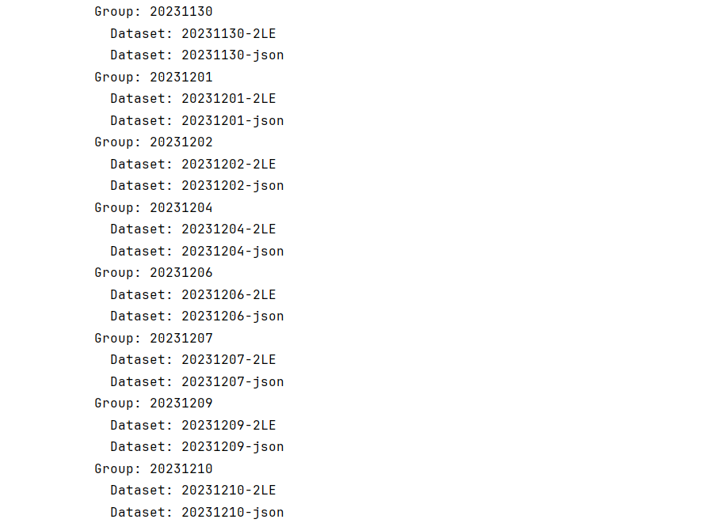
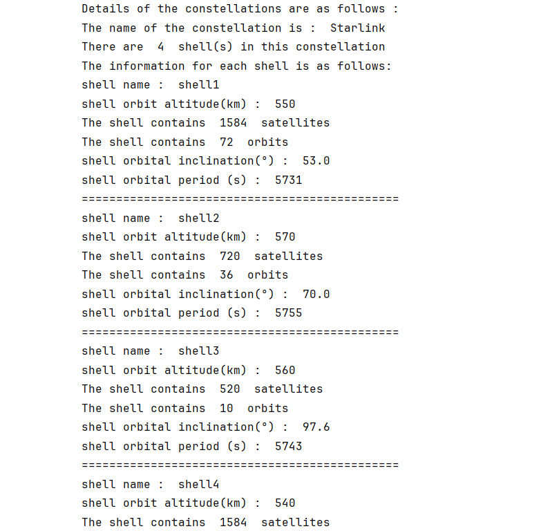
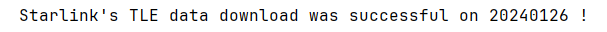
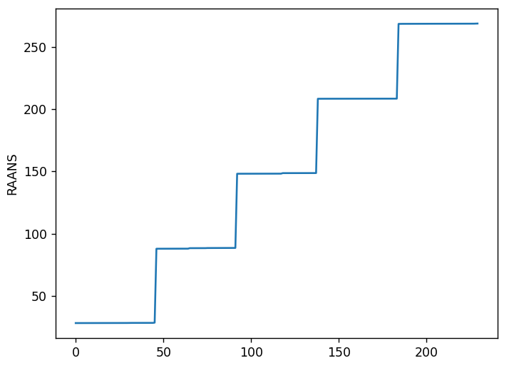
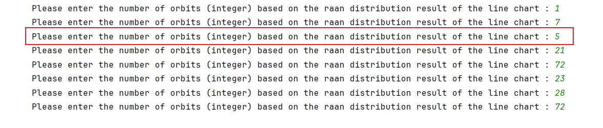
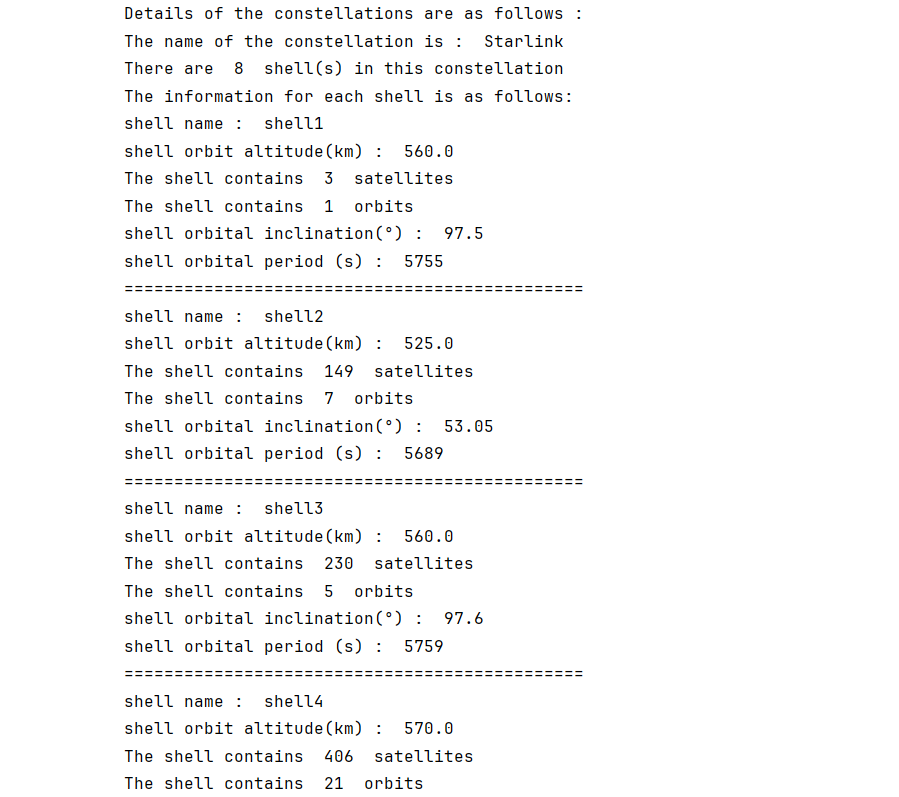
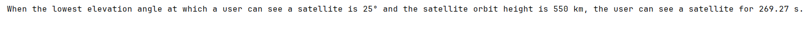

# 1. Introduction

StarPerf 2.0 is a feature-rich, highly open, and easily extensible constellation performance simulation platform. The platform architecture is 

**<span style='color:red;font-size:40px;'>"framework + plug-in"</span>**

that is: we have built a basic framework, which is used to implement various underlying functions of StarPerf 2.0 and provides a unified programming interface API to the outside. Various specific functions of the platform exist in the form of plug-ins, which are written based on the API provided by the framework. In this system, plug-ins and framework are decoupled, so StarPerf 2.0 is highly open and easily expandable.

StarPerf 2.0 supports two ways to build a constellation: the first way is to use XML configuration files to build a Walker-δ constellation, and the second way is to use TLE data to build a real constellation (Starlink, etc.).

Currently, we have provided a variety of functional plug-ins, such as the constellation connectivity mode plug-in "+Grid", the constellation routing strategy plug-in "Shortest Path Routing", the constellation high survival simulation plug-in "Solar Storm Damage Model", etc. 

Of course, you can also write the functional plug-ins you are interested in based on the interface API provided by the framework to achieve personalized functions. The remainder of this document is used to introduce various API interface specifications provided by the framework so that you can better use StarPerf 2.0 to complete your simulation tasks.

# 2. Environment & Dependencies

<a id="EnvironmentAndDependencies"></a>

Before we begin, we first introduce the operating environment of StarPerf 2.0 and its dependent libraries so that you can install StarPerf 2.0 correctly.

It is developed based on Python 3.10, so we recommend that your **Python version is ≥3.10**. In addition to the Python 3.10 standard library, it also uses the following open source Python third-party libraries:

**Table 1 : third-party Python libraries and versions**

|      Library       | Version |
| :----------------: | :-----: |
|         h3         | 4.0.0b2 |
|        h5py        | 3.10.0  |
|       numpy        | 1.24.4  |
|      openpyxl      |  3.1.2  |
| importlib-metadata |  6.8.0  |
|      skyfield      |  1.46   |
|        sgp4        |  2.22   |
|       pandas       |  2.1.0  |
|     poliastro      | 0.17.0  |
|      astropy       |  5.3.3  |
|      networkx      |   3.1   |
|      requests      | 2.31.0  |
|      jenkspy       |  0.4.0  |
|     pyecharts      |  2.0.4  |

The third-party Python libraries in the above table and their corresponding version numbers are all listed in "docs/third-party_libraries_list.txt" in the form of "LibraryName==LibraryVersion" (such as "numpy==1.24.4"), and you can execute the 

**<span style='color:red;font-size:20px;'>"pip install -r docs/third-party_libraries_list.txt"</span>** 

command in the root directory of the StarPerf 2.0 project to install all third-party Python libraries at once.

Finally, StarPerf 2.0 does not depend on any non-Python environment, so you do not need to install any third-party orbit analysis/calculation tools (STK, etc.).

# 3. Architecture

The first-level architecture of StarPerf 2.0 is as follows :


The functions of each first-level module in the above figure are as follows : 

**Table 2 : StarPerf 2.0 first-level modules and functions**

|   Module    |                           Function                           |
| :---------: | :----------------------------------------------------------: |
|   config/   | **Configuration Information Module**, is used to store configuration files, such as constellation configuration information, ground station information, etc. |
|    data/    | **Data Storage Module**, is used to store preloaded data and intermediate data and result data generated during system operation, such as cells of different resolutions in the h3 library, satellite position data, etc. |
|    docs/    | **Documentation Module**, is used to store various documentation, pictures, and dependent library information of StarPerf 2.0, such as this document, the list of third-party Python libraries that the system depends on. |
|  samples/   | **Test Sample Module**, is used to store test case scripts for each functional module, and these scripts are independent of each other and can be directly called and run. |
|    kits/    | **Auxiliary Script Module**, is used to store some auxiliary scripts written to complete system functions, such as ".xlsx" file conversion ".xml" file scripts, etc. |
|    src/     | **Kernel Module**, is the core module of StarPerf 2.0, which contains all the core code of each functional module. The "framework + plug-in" architecture mentioned earlier is this module. |
| StarPerf.py | **StarPerf 2.0 Startup Script**, users should start StarPerf 2.0 from this script. |

# 4. Configuration Information Module : config/

This module stores all data information related to constellation configuration in StarPerf 2.0, and the structure diagram of this module is as follows :


The functions of each module in the above figure are as follows : 

**Table 3 : config module**

| Module             | Function                                                     |
| ------------------ | ------------------------------------------------------------ |
| TLE_constellation/ | Stores the data information required to generate constellations using TLE. Each constellation is described by a TLE data file (.h5) and a launch batch information file (.xml). |
| XML_constellation/ | Stores the data information required to generate constellations using XML data. Each constellation is described by an .xml file. |
| ground_stations/   | Stores the ground station data of the constellation. All ground station information for each constellation is described by an .xml file. |
| POPs/              | Store the POP points data of the constellation. All POP points information for each constellation is described by an .xml file. |

## 4.1 h5 file introduction

This format file is generally used to store scientific data. It has a structure similar to a "file directory" and allows the data in the file to be organized in many different structured ways, just like working with files on a computer. 

There are two main structures in h5 files: **group** and **dataset**. An h5 file is a combination of several groups and datasets.

- **group** : A grouping structure containing 0 or more instances of a dataset or group, along with supporting metadata.
- **dataset** : A data collection organized in an array-like manner, working like a numpy array, a dataset is a numpy.ndarray. The specific dataset can be images, tables, or even pdf files and excel.

Working with groups and datasets is in many ways similar to working with directories and files in UNIX. Like UNIX directories and files, objects in h5 files are usually described by providing full (or absolute) pathnames.


Reading and writing h5 files can be completed through Python's h5py library. For specific usage, see "kits/".

## 4.2 TLE_constellation/

This folder stores the data information of the constellation generated by TLE. Each constellation is described by a folder named after the constellation. There are two files in this folder, one is the .h5 file that stores TLE, and the other is the .xml file that stores satellite launch information. In the .h5 file that stores TLE, each day's TLE data is a Group, and the Group name is the date of the day. Each Group contains two Datasets. The first Dataset is a TLE containing two rows of information, and the second Dataset is a TLE in JSON format. For example, the tree structure of the "config/TLE_constellation/Starlink/tle.h5" file is as shown below : 



The structure of the .xml file that stores satellite launch information is as follows:

```xml
<Launches>
  <Launch1>
    <COSPAR_ID>2019-074</COSPAR_ID>
    <Altitude>550</Altitude>
    <Inclination>53</Inclination>
  </Launch1>
  ......
</Launches>
```

The root element of the xml file is "Launches". The root element contains several elements, each element is named with "Launch+\<number>" (such as "Launch1", "Launch2", etc.), which is used to represent a satellite launch information. Each launch contains three types of information: [COSPAR_ID](https://en.wikipedia.org/wiki/International_Designator#:~:text=The%20International%20Designator%2C%20also%20known%20as%20COSPAR%20ID%2C,sequential%20identifier%20of%20a%20piece%20in%20a%20launch.) , orbit altitude Altitude (unit: kilometers) and orbit inclination (unit: °).

## 4.3 XML_constellation/

This folder stores the data information of the constellation generated by XML. Walker-δ constellations and polar constellations can be generated using XML files. In this way of generating constellations, each constellation only requires a .xml configuration information file, and no TLE is required. Taking Starlink as an example, the .xml configuration information file of the constellation is "config/XML_constellation/Starlink.xml". The content of the file is as follows :

```xml
<constellation>
    <number_of_shells>4</number_of_shells>
    <shell1>
        <altitude>550</altitude>
        <orbit_cycle>5731</orbit_cycle>
        <inclination>53.0</inclination>
        <phase_shift>1</phase_shift>
        <number_of_orbit>72</number_of_orbit>
        <number_of_satellite_per_orbit>22</number_of_satellite_per_orbit>
    </shell1>
    ......
</constellation>
```

The root element of the document is "\<constellation>". The first sub-element inside the root element is "\<number_of_shells>", which represents the number of shells in the constellation. In this example, we assume that the value is 4, then there will be 4 sub-elements under the root element "\<shell1>" "\<shell2>"..."\<shell4>", representing different shells respectively. There are 6 sub-elements inside each shell, representing orbital altitude (unit: km), orbital period (unit: s), orbital inclination (unit: °), phase shift, number of orbits and number of satellites in each orbit. 

## 4.4 ground_stations/

This folder stores the ground station information of the constellation. The ground station information of each constellation is described by an .xml file named after the constellation name. The content of Starlink's ground station information file "config/ground_stations/Starlink.xml" is as follows : 

```xml
<GSs>
  <GS1>
    <Latitude>-12.74832</Latitude>
    <Longitude>-38.28305</Longitude>
    <Description>Camaçari, BR</Description>
    <Frequency>Ka</Frequency>
    <Antenna_Count>8</Antenna_Count>
    <Uplink_Ghz>2.1</Uplink_Ghz>
    <Downlink_Ghz>1.3</Downlink_Ghz>
  </GS1>
  ......
</GSs>
```

The root element of the document is "\<GSs>". In this example, we assume that there are 10 ground station, then there will be 10 sub-elements under the root element "\<GS1>" "\<GS2>"..."\<GS10>", representing different ground station respectively. There are 7 sub-elements inside each GS, representing ground station latitude, ground station longitude, ground station location description, ground station frequency, ground station antenna count, ground station uplink(GHz) and ground station downlink(GHz).

## 4.5 POPs/

This folder stores the POP information of the constellation. The POP information of each constellation is described by an .xml file named after the constellation name. The content of Starlink's POP information file "config/POPs/Starlink.xml" is as follows : 

```xml
<POPs>
  <POP1>
    <Latitude>47.6048790423666</Latitude>
    <Longitude>-122.333542912036</Longitude>
    <Name>SEA - STTLWAX1</Name>
  </POP1>
  ......
</POPs>
```

The root element of the document is "\<POPs>". In this example, we assume that there are 10 POPs, then there will be 10 sub-elements under the root element "\<POP1>" "\<POP2>"..."\<POP10>", representing different POP respectively. There are 3 sub-elements inside each POP, representing POP latitude, POP longitude and POP name.

# 5. Data Storage Module : data/

This module stores various data when StarPerf 2.0 is running, which can be divided into three categories :

- **Preloaded data** : the data that StarPerf 2.0 must read when running certain functions, such as the data of Uber h3 library cells, which is located in "data/h3_cells_id_res0-4.h5".
- **Intermediate data** : StarPerf 2.0 needs to temporarily store some data when running certain functions, such as the delay matrix of the constellation, satellite position data, etc. These data are stored in "TLE_constellation/\<constellation\_name>.h5"  (such as "data/TLE_constellation/Starlink.h5") or "XML_constellation/\<constellation\_name>.h5" (such as "data/XML_constellation/Starlink.h5").
- **Result data** : the final results produced after StarPerf 2.0 runs, such as some output drawings in pdf format, etc.

# 6. Documentation Module : docs/

Stored under this module are various documentation related to StarPerf 2.0. For example, this document exists under this module, and all illustrations referenced in this document also exist under this module.

In addition, there is an important file under this module: "third-party_libraries_list.txt". This file describes all third-party Python libraries and versions that StarPerf 2.0 depends on. Please refer to the **"[Environment & Dependencies](#EnvironmentAndDependencies)"** chapter for the specific usage of this document, which will not be described again here.

# 7. Auxiliary Script Module : kits/

This module stores some auxiliary scripts written to complete the core functions of StarPerf 2.0, such as file format conversion scripts, h5 file reading scripts, etc.

For example, if you want to view the tree structure of an h5 file, you can run "get_h5file_tree_structure.py". This script will read "data/XML_constellation/Starlink.h5" and display the group and dataset information in it. The script execution results are as follows : 


Explanation of execution results: the above figure shows that "data/XML_constellation/Starlink.h5" contains 2 first-level groups: position and delay, which represent satellite position data and constellation delay matrix data respectively. Each first-level group contains 4 second-level groups, which represent each layer of shell data. Each secondary group contains 2 datasets, representing the data of two timestamps.

For another example, if you want to view the h3id of all cells at the specified resolution in "data/h3_cells_id_res0-4.h5", you can execute "print_h3_cells_h3id.py". Assume that you now want to view the h3id of all cells with a resolution of 0, part of the execution results of this script are as follows:


Explanation of execution results: each row in the above figure represents the h3id of a cell with a resolution of 0. Due to space limitations, only part of the execution results are shown here. More detailed results can be viewed by executing the script.

# 8. Kernel Module : src/

This module is the kernel code module of StarPerf 2.0, which stores the system's "framework + plug-in". The architecture of this module is as follows :


The function of each module in the above figure are as follows : 

**Table 4 : kernel module submodules and functions**

|          Module           |                           Function                           |
| :-----------------------: | :----------------------------------------------------------: |
| constellation_generation/ | part of the "framework" that implements constellation generation and constellation initialization. |
|    standalone_module/     | Provide some independent function modules, such as calculating the length of satellite time that users can see. |
|    TLE_constellation/     |           Construct constellations using TLE data.           |
|    XML_constellation/     |           Construct constellations using XML data.           |

## 8.1 constellation_generation/

This module is used to generate and initialize satellite constellations. StarPerf 2.0 supports two ways of generating constellations: the first is to use XML documents to build Walker-δ or polar constellations, and the second is to use TLE data to build real constellations.

### 8.1.1 build constellations using XML files

This method uses two scripts to complete the constellation generation : "constellation\_configuration.py" and "orbit\_configuration.py". After the following two scripts are executed, the constellation is generated. Now, we introduce the execution mechanism of these two scripts respectively.

#### 8.1.1.1 constellation\_configuration.py

The startup function of this script is "constellation\_configuration". See the table below for relevant information about this function.

**Table 5 : constellation\_configuration information**

|   Parameter Name   | Parameter Type | Parameter Unit |                      Parameter Meaning                       |
| :----------------: | :------------: | :------------: | :----------------------------------------------------------: |
|         dT         |      int       |     second     | indicates how often timestamps are recorded, and this value must be less than the orbital period of the satellite |
| constellation_name |      str       |       -        | the name of the constellation, and the value of this parameter must have the same name as an xml file in "config/XML_constellation". The xml file with the same name is the configuration file of the constellation named with that name |

When executing the function "constellation\_configuration", the xml file under the "config/XML_constellation/" path will be loaded according to the parameter "constellation_name", that is:

```python
xml_file_path = "config/XML_constellation/" + constellation_name + ".xml"
```

Afterwards, each shell of the constellation will be generated based on the xml data. Generating each shell consists of two stages.

**Stage 1** : Generating the basic parameters of the shell, such as orbital altitude, orbital period, orbital inclination, number of orbits, number of satellites in each orbit, etc. This stage can be completed directly using xml data. 

<a id="Stage2"></a>

**Stage 2** : Generating orbits and satellites in the shell. This stage is implemented by two Python third-party libraries, skyfield and sgp4. We put the specific implementation of this part in "orbit\_configuration.py". You only need to just call this script in "constellation\_configuration.py". 

After the completion of these two stages, the target constellation initialization task has been completed. At this time, we save the position information of each satellite in the constellation at each moment in an h5 file under "data/XML_constellation".

**Note : The number of constellation moments is determined by the parameter dT and the orbital period. That is, a total of "(int)(orbit_cycle / dT)" satellite position data needs to be saved to the h5 file.**

Finally, the return value of this function represents the generated constellation, which is a constellation object.

#### 8.1.1.2 orbit\_configuration.py

The startup function of this script is "orbit\_configuration". See the table below for relevant information about this function.

**Table 6 : orbit\_configuration information**

| Parameter Name | Parameter Type | Parameter Unit |                      Parameter Meaning                       |
| :------------: | :------------: | :------------: | :----------------------------------------------------------: |
|       dT       |      int       |     second     | indicates how often timestamps are recorded, and this value must be less than the orbital period of the satellite |
|       sh       |     shell      |       -        |           shell to generate orbits and satellites            |

When this function is executed, the system will generate the Kepler parameters of each orbit based on the existing parameters of "sh" (number of orbits, orbital inclination, number of satellites in each orbit, etc.). Then, in-orbit satellites are generated based on the generated orbits. This process uses the skyfield and sgp4 libraries.

This function is called by "constellation\_configuration.py" and is responsible for completing the functions of **"[Stage 2](#Stage2)"**. Therefore, this function has no return value. After execution, continue to execute "constellation\_configuration.py".

#### 8.1.1.3 case study

Now, we give an example of Walker-δ constellation generation and initialization to facilitate your understanding.

**Step 1** : we define the two function parameters in Table 5, as follows :

```python
dT = 5730
constellation_name = "Starlink"
```

**Step 2** : we call the "constellation\_configuration" function of the "constellation\_configuration.py" to generate the constellation :

```python
# generate the constellations
constellation = constellation_configuration.constellation_configuration(dT=dT,                                                                                                 constellation_name=constellation_name)
```

After the above two steps, we have obtained a constellation. Now print out some basic parameter information of the constellation, as follows (part) :



The complete code of the above process can be found at :  "samples/XML_constellation/constellation_generation/constellation_generation_test.py".

### 8.1.2 build constellations using TLE data

This method uses five scripts to complete the constellation generation : "download_TLE_data.py", "satellite_to_shell_mapping.py", "satellite_to_orbit_mapping.py", "get_satellite_position.py" and "constellation_configuration.py". Overall, the constellation generated by this method can be divided into four stages : 

**Stage 1** : download TLE data, and this function is implemented by "download_TLE_data.py".

**Stage 2** : determine the shell to which the satellite belongs, and this function is implemented by "satellite_to_shell_mapping.py".

**Stage 3** : determine the orbit to which the satellite belongs, and this function is implemented by "satellite_to_orbit_mapping.py".

**Stage 4** : save the satellite position information of each timeslot to a .h5 file, and this function is implemented by "get_satellite_position.py".

Now, we introduce the execution mechanism of these five scripts respectively.

#### 8.1.2.1 download_TLE_data.py

This method requires the use of two types of data to construct a constellation. The first type is the emission information of the constellation satellites, and the second type is the TLE of all satellites in the constellation.

For the first type of data, in StarPerf 2.0, we provide Starlink satellite launch data by default., and these data are stored at : "config/TLE_constellation/Starlink/launches.xml". Satellite launch data source : https://en.wikipedia.org/wiki/List_of_Starlink_and_Starshield_launches#Launches

For the second type of data, it can be downloaded from here: https://celestrak.org/NORAD/elements/

The startup function of this script is "download_TLE_data". This function only accepts one parameter, which is the constellation name of the TLE data to be downloaded.

In order to facilitate the implementation of the following functions, here we will download two types of TLE, 2LE and JSON. 2LE format, that is, TLE data containing only two rows of elements, such as : 

```
1 44713U 19074A   24025.32501904 -.00001488  00000+0 -81005-4 0  9997
2 44713  53.0536  62.8760 0001441  94.1015 266.0138 15.06396809232035
```

JSON format, that is, parsing TLE data into JSON data, such as : 

```json
{
    "OBJECT_NAME": "STARLINK-1007",
    "OBJECT_ID": "2019-074A",
    "EPOCH": "2024-01-25T07:48:01.645056",
    "MEAN_MOTION": 15.06396809,
    "ECCENTRICITY": 0.0001441,
    "INCLINATION": 53.0536,
    "RA_OF_ASC_NODE": 62.876,
    "ARG_OF_PERICENTER": 94.1015,
    "MEAN_ANOMALY": 266.0138,
    "EPHEMERIS_TYPE": 0,
    "CLASSIFICATION_TYPE": "U",
    "NORAD_CAT_ID": 44713,
    "ELEMENT_SET_NO": 999,
    "REV_AT_EPOCH": 23203,
    "BSTAR": -8.1005e-5,
    "MEAN_MOTION_DOT": -1.488e-5,
    "MEAN_MOTION_DDOT": 0
  }
```

When the TLE data is downloaded successfully, the system will output prompt information on the terminal, such as : 



TLE data in these two formats will eventually be saved in the "config/TLE_constellation/ + <constellation_name> + /tle.h5" file.

**Note : When using TLE data to generate constellations, please ensure that your computer can be connected to the Internet because an Internet connection is required to download the data.**

#### 8.1.2.2 satellite_to_shell_mapping.py

This script establishes a corresponding relationship between each satellite described in the TLE data and the shell in which it is located, and the satellite's launch information is used to establish this relationship.

Implementation mechanism: In the TLE data in JSON format, there is a field named "OBJECT_ID", from which the launch batch number (COSPAR_ID) of the satellite can be obtained, combined with "config/TLE_constellation/+<constellation_name>+ /launches.xml", the corresponding relationship between COSPAR_ID, orbital altitude and orbital inclination can be used to infer the shell to which a satellite belongs.

The startup function of this script is "satellite_to_shell_mapping". This function accepts only one parameter, the name of the constellation.

#### 8.1.2.3 satellite_to_orbit_mapping.py

Section 8.1.2.2 determines the shell to which the satellite belongs. This section is used to determine the orbit to which the satellite belongs.

Implementation mechanism: Sort the ascending node right ascension (raan) of all satellites in a shell, and then draw a distribution line chart of raan. The user observes the line chart and manually inputs the number of orbits. Subsequently, based on the number of orbits input by the user, we use the natural breakpoint method to divide these satellites into several orbits to determine the correspondence between satellites and orbits.

When the script is executed, the program will output (some) line charts. The user needs to observe the line charts and determine the approximate number of tracks, and enter the approximate number into the program. For example, the following figure is a line chart output during program execution : 



From this line chart, we can see that there are 5 values for raan, which means there are 5 tracks, so you need to manually enter 5 in the console : 



After you complete the input, the program will continue to run and use the natural breakpoint method to determine the orbit to which the satellite belongs based on the data you entered. A third-party library in Python called jenkspy has implemented the natural breakpoint method, so the jenkspy library is used here to determine the orbit to which the satellite belongs. Regarding the principles of the natural breakpoint method, you can refer here: https://pbpython.com/natural-breaks.html

The startup function of this script is "satellite_to_orbit_mapping". This function only accepts one parameter, which is a shell class object.

After the script is executed, the constellation has been generated.

#### 8.1.2.4 get_satellite_position.py

After the end of Section 8.1.2.3, the constellation has been generated. Now the position information (latitude, longitude and altitude) of each satellite needs to be saved, so the position of the satellite needs to be calculated based on TLE data.

Here we use the skyfield library to calculate the satellite's position information. The specific implementation is: input the TLE data and the time corresponding to the TLE, and the skyfield library can parse out the longitude, latitude and altitude information of the satellite.

Finally, we save the satellite position information of each timeslot into a .h5 file. The storage location of this file: "data/TLE_constellation/".

#### 8.1.2.5 constellation_configuration.py

This script is used to call download_TLE_data.py, satellite_to_shell_mapping.py, satellite_to_orbit_mapping.py and get_satellite_position.py to complete the constellation initialization function.

The startup function of this script is "constellation_configuration". See the table below for relevant information about this function.

**Table 7 : constellation_configuration**

|   Parameter Name   | Parameter Type | Parameter Unit |                      Parameter Meaning                       |
| :----------------: | :------------: | :------------: | :----------------------------------------------------------: |
|         dT         |      int       |     second     | indicates how often timestamps are recorded, and this value must be less than the orbital period of the satellite |
| constellation_name |      str       |       -        | the name of the constellation, the value of this parameter must have the same name as the subfolder in "config/TLE_constellation/". The configuration file of the constellation named by that name is stored in a subfolder with the same name. |

When you need to use TLE data to generate a constellation, you only need to call this script to complete.

#### 8.1.2.6 case study

Now, we give an example of constellation generation using TLE data for easy understanding.

**Step 1** : we define the two function parameters in Table 7, as follows :

```python
dT = 1000
constellation_name = "Starlink"
```

**Step 2** : we call the "constellation\_configuration" function of the "constellation\_configuration.py" to generate the constellation :

```python
# generate the constellations
constellation = constellation_configuration.constellation_configuration(dT, constellation_name)
```

After the above two steps, we have obtained a constellation. Now print out some basic parameter information of the constellation, as follows (part) :



The complete code of the above process can be found at :  "samples/TLE_constellation/constellation_generation/constellation_generation_test.py".

## 8.2 standalone_module/

This module is used to implement some relatively independent functions and can be used by users as needed.

### 8.2.1 satellite visible time calculation

In some cases, it may be necessary to calculate the time a satellite is visible to the user. For example, we need to calculate how long the satellite can be observed by ground users in the scenario shown in the figure below : 


This is a simple geometric calculation function implemented by "src/standalone_module/satellite_visibility_time.py". The startup function of this script is "satellite_visibility_time". See the table below for relevant information about this function.

**Table 8 : satellite_visibility_time**

| Parameter Name | Parameter Type | Parameter Unit |                      Parameter Meaning                       |
| :------------: | :------------: | :------------: | :----------------------------------------------------------: |
|       θ        |     float      |     degree     | the lowest elevation angle at which the user can see the satellite |
|       h        |     float      |       km       | the height of a satellite's orbit above the earth's surface  |

### 8.2.2 case study

Now, we give an example of calculating the satellite time visible to ground users for easier understanding : 

```python
satellite_visibility_time(θ=25 , h=550)
```

The results of executing the above code are as follows : 



The complete code of the above process can be found at :  "samples/standalone_module/standalone_module_test_cases.py".

## 8.3 TLE_constellation/ & XML_constellation/

We generated the constellation using XML and TLE in Section 8.1. In this section, we will implement some evaluation metrics based on the generated constellations. Whether using XML or TLE, the interface provided by the final constellation is exactly the same, so the constellations generated by these two methods can share a set of codes to write evaluation indicators.

The core functional modules are shown in the following table : 

**Table 9 : core functional modules and functions**

|       Module       |                           Function                           |
| :----------------: | :----------------------------------------------------------: |
|   beamplacement/   | **constellation\_beamplacement** : implement part of the "framework" related to beam placement, as well as plug-ins related to beam placement algorithms. |
|   connectivity/    | **constellation\_connectivity** : implements parts of the "framework" related to the connectivity mode between satellites in the constellation, as well as plug-ins for the connectivity mode. |
|    evaluation/     | **constellation\_evaluation** : implement part of the "framework" related to constellation performance evaluation, such as delay, bandwidth, coverage, etc. |
|      entity/       | **constellation\_entity** : the entity classes in StarPerf 2.0 are defined, such as orbit, satellite, ground stations, etc., and this module is part of the "framework". |
| highsurvivability/ | **constellation\_highsurvivability** : implement part of the "framework" related to the high survivability aspect of the constellation, as well as some constellation damage model plug-ins. |
|      routing/      | **constellation\_routing** : implements part of the "framework" for constellation routing, as well as some routing strategy plug-ins. |

### 8.3.1 constellation\_beamplacement

This part includes two aspects. One is  "framework" part : beam placement plug-in manager, another is the "plug-in" part : various beam placement algorithms. After explaining these two parts, we give a case study so that you can better understand the working mechanism of this module.

#### 8.3.1.1 plug-ins

All plug-ins under this module are beam placement algorithms, and one plug-in represents a beam placement algorithm. We implement the random beam placement algorithm(i.e. "**random_placement.py**") by default, and you can write other beam placement algorithm plug-ins by yourself according to the interface specifications. The interface specifications for this part are as follows : 

- **Requirement 1** : The storage location of the plug-in is (starting from the root of StarPerf 2.0) : "src/TLE_constellation/constellation_beamplacement/beam_placement_plugin/"(for TLE constellation) or "src/XML_constellation/constellation_beamplacement/beam_placement_plugin/"(for XML constellation).
- **Requirement 2** : Each plug-in is a ".py" file, and all source code for the plug-in must be located in this script file.
- **Requirement 3** : The launch entry for a plug-in is a function with the same name as the plug-in.
- **Requirement 4** : The startup function parameter requirements are as follows : 

**Table 10 : beam placement plug-ins startup function parameter list**

| Parameter Name              | Parameter Type | Parameter Unit | Parameter Meaning                                                                                               |
|:---------------------------:|:--------------:|:--------------:|:---------------------------------------------------------------------------------------------------------------:|
| sh                          | shell          | -              | a shell class object, representing a layer of shell in the constellation                                        |
| h3\_resolution              | int            | -              | the resolution of cells divided by h3 library, and currently supported resolutions are: 0/1/2/3/4               |
| antenna_count_per_satellite | int            | -              | the number of antennas each satellite is equipped with                                                          |
| dT                          | int            | second         | indicates how often the beam is scheduled, and this value must be less than the orbital period of the satellite |
| minimum_elevation           | float          | degree         | the minimum elevation angle at which a satellite can be seen from a point on the ground                         |

- **Requirement 5** : The return value of the startup function is all cells covered after executing the beam placement algorithm.
- **Requirement 6** : If one plug-in needs to save intermediate data or result data, the data should be saved in an h5 format file under "data/".

#### 8.3.1.2 framework

This part of the framework consists of 1 py script: "**beam\_placement\_plugin\_manager.py**". A beam placement plug-in manager is defined in this script to manage all plug-ins under this module. 

The so-called beam placement plug-in manager actually defines a class named "beam\_placement\_plugin\_manager". The attributes and methods contained in this class and their functions and meanings are shown in the tables below.

**Table 11 : beam placement plug-in manager attributes list**

| Attribute Name                 | Attribute Type | Attribute Meaning                                                                                                                                                                               |
|:------------------------------:|:--------------:|:-----------------------------------------------------------------------------------------------------------------------------------------------------------------------------------------------:|
| plugins                        | dict           | a dictionary composed of all plug-ins. The "key" is the plug-in name, which is a string type, and the "value" is the plug-in startup function in the corresponding plug-in, which is a function |
| current\_beamplacement\_policy | str            | plug-in name used by the current beam placement plug-in manager                                                                                                                                 |

**Table 12 : beam placement plug-in manager methods list**

| Method Name                    | Parameter List<br />(name : type : unit)                                                                                                                | Return Values                        | Method Function                                                                                                                                                              |
|:------------------------------:|:-------------------------------------------------------------------------------------------------------------------------------------------------------:|:------------------------------------:|:----------------------------------------------------------------------------------------------------------------------------------------------------------------------------:|
| \_\_init\_\_                   | -                                                                                                                                                       | -                                    | initialize an instance of the beam placement plugin manager                                                                                                                  |
| set\_beamplacement\_policy     | (plugin\_name : str : -)                                                                                                                                | -                                    | set the value of current\_beamplacement\_policy to plugin\_name                                                                                                              |
| execute\_beamplacement\_policy | (sh : shell : - , <br />h3_resolution : int : - , antenna_count_per_satellite : int : - , <br />dT : int : second , minimum_elevation : float : degree) | cells covered by the beam, all cells | according to the value of the current\_beamplacement\_policy attribute, the startup function of the corresponding plug-in is called to execute the beam placement algorithm. |

The operating mechanism of this framework is: first instantiate a beam placement plug-in manager object. This object contains two attributes: "plugins" and "current\_beamplacement\_policy". "plugins" is a dictionary type attribute used to store various beam placement plugins. "current\_beamplacement\_policy" is a string type used to represent the beam placement plugin used by the current manager.

During the instantiation of the manager object, the system automatically reads all beam placement plug-ins and stores them in the "plugins". The key of "plugins" is the name of the plugin, and the value of "plugins" is the startup function of the plugin. After reading all plug-ins, the system sets the value of "current\_beamplacement\_policy" to "random_placement", indicating that the "random_placement" plug-in is used as the default beam placement algorithm.

If you want to execute the beam placement algorithm, you only need to call the "execute_beamplacement_policy" method of the manager object. This method will automatically call the startup function of the plug-in indicated by "current\_beamplacement\_policy".

If you need to switch the beam placement plug-in, just call the "set_beamplacement_policy" method and pass in the plug-in name you need as a parameter.

After you write your own beam placement algorithm plug-in according to the interface specifications introduced earlier, you only need to set "current\_beamplacement\_policy" as your plug-in name, and the system will automatically recognize your plug-in and execute it.

#### 8.3.1.3 case study

Now, we take "random_placement" as an example to explain the operation of the beam placement module.

**Step 1** : instantiate the beam placement plug-in manager object :

```python
beamPlacementPluginManager = beam_placement_plugin_manager.beam_placement_plugin_manager()
```

**Step 2** : set the currently used beam placement plug-in : 

```python
beamPlacementPluginManager.set_beamplacement_policy("random_placement")
```

**Note : The beam placement plug-in manager already sets the "current\_beamplacement\_policy" value to "random\_placement" when initialized, so this step can be omitted here. But if you want to use other beam placement plug-ins, this step cannot be omitted.**

**Step 3** : call the "execute\_beamplacement\_policy" method of "beamPlacementPluginManager" to execute the "random\_placement" plug-in : 

```python
covered_cells_per_timeslot,Cells = beamPlacementPluginManager.execute_beamplacement_policy(bent_pipe_constellation.shells[0] ,
                                    h3_resolution , antenna_count_per_satellite , dT , minimum_elevation)
```

There are two return values in Step 3 : "covered\_cells\_per\_timeslot" represents the cells covered by the beam, and "Cells" represents all cells (including those covered by the beam and those not covered by the beam).

The code execution results are as follows (part) : 


The complete code of the above process can be found at: "samples/TLE_constellation/beam_placement/random_placement.py" and "samples/XML_constellation/beam_placement/random_placement.py".

### 8.3.2 constellation\_connectivity

This section is also composed of "framework" and "plug-ins". The "framework" part is the "connectivity mode plugin manager". The "plug-ins" part is the connection method between satellites, such as +Grid. 

#### 8.3.2.1 plug-ins

All plug-ins under this module are ISL establishment modes, and one plug-in represents a mode. We implement the +Grid mode and bent-pipe mode by default, and you can write other ISL establishment mode plug-ins by yourself according to the interface specifications. The interface specifications for this part are as follows : 

- **Requirement 1** : The storage location of the plug-in is (starting from the root of StarPerf 2.0) : "src/TLE_constellation/constellation_connectivity/connectivity_plugin/"(for TLE constellation) or "src/XML_constellation/constellation_connectivity/connectivity_plugin/"(for XML constellation).
- **Requirement 2** : Each plug-in is a ".py" file, and all source code for the plug-in must be located in this script file.
- **Requirement 3** : The launch entry for a plug-in is a function with the same name as the plug-in.
- **Requirement 4** : The startup function parameter requirements are as follows : 

**Table 13 : ISL establishment mode plug-ins startup function parameter list**

| Parameter Name | Parameter Type | Parameter Unit |                      Parameter Meaning                       |
| :------------: | :------------: | :------------: | :----------------------------------------------------------: |
| constellation  | constellation  |       -        |              the constellation to establish ISL              |
|       dT       |      int       |     second     | indicates how often the beam is scheduled, and this value must be less than the orbital period of the satellite |

- **Requirement 5** : The startup function has no return value.
- **Requirement 6** : After establishing the ISL, write the constellation delay matrix into a .h5 file. The Group name is: "delay", and the Dataset name is: "timeslot+\<number>" (such as "timeslot1", "timeslot2"), and the .h5 file storage path :  "data/TLE_constellation/" (for TLE constellation) or "data/XML_constellation/" (for XML constellation).

#### 8.3.2.2 framework

This part of the framework consists of 1 py script: "**connectivity_mode_plugin_manager.py**". A connectivity mode plugin manager is defined in this script to manage all plug-ins under this module. 

The so-called connectivity mode plugin manager actually defines a class named "connectivity_mode_plugin_manager". The attributes and methods contained in this class and their functions and meanings are shown in the tables below.

**Table 14 : connectivity mode plugin manager attributes list**

|     Attribute Name      | Attribute Type |                      Attribute Meaning                       |
| :---------------------: | :------------: | :----------------------------------------------------------: |
|         plugins         |      dict      | a dictionary composed of all plug-ins. The "key" is the plug-in name, which is a string type, and the "value" is the plug-in startup function in the corresponding plug-in, which is a function |
| current_connection_mode |      str       | plug-in name used by the current connectivity mode plugin manager |

**Table 15 : connectivity mode plugin manager methods list**

|        Method Name        |           Parameter List<br />(name : type : unit)           | Return Values |                       Method Function                        |
| :-----------------------: | :----------------------------------------------------------: | :-----------: | :----------------------------------------------------------: |
|       \_\_init\_\_        |                              -                               |       -       | initialize an instance of the connectivity mode plugin manager |
|    set_connection_mode    |                   (plugin\_name : str : -)                   |       -       |   set the value of current_connection_mode to plugin\_name   |
| execute_connection_policy | (constellation : constellation : - ,  <br />dT : int : second) |       -       | according to the value of the current_connection_mode attribute, the startup function of the corresponding plug-in is called to execute the ISL establishment. |

The operating mechanism of this framework is: first instantiate a connectivity mode plugin manager object. This object contains two attributes: "plugins" and "current_connection_mode". "plugins" is a dictionary type attribute used to store various connectivity mode plugins. "current_connection_mode" is a string type used to represent the connectivity mode plugin used by the current manager.

During the instantiation of the manager object, the system automatically reads all connectivity mode plugins and stores them in the "plugins". The key of "plugins" is the name of the plugin, and the value of "plugins" is the startup function of the plugin. After reading all plug-ins, the system sets the value of "current_connection_mode" to "positive_Grid", indicating that the "positive_Grid" plug-in is used as the default connectivity mode plugin.

If you want to execute the connectivity mode, you only need to call the "execute_connection_policy" method of the manager object. This method will automatically call the startup function of the plug-in indicated by "current_connection_mode".

If you need to switch the connectivity mode plug-in, just call the "set_connection_mode" method and pass in the plug-in name you need as a parameter.

After you write your own connectivity mode plug-in according to the interface specifications introduced earlier, you only need to set "current_connection_mode" as your plug-in name, and the system will automatically recognize your plug-in and execute it.

#### 8.3.2.3 case study

Now, we take "positive_Grid" as an example to explain the operation of the constellation connectivity module.

**Step 1** : instantiate the connectivity mode plugin manager object :

```python
# initialize the connectivity mode plugin manager
connectionModePluginManager = connectivity_mode_plugin_manager.connectivity_mode_plugin_manager()
```

**Step 2** : set the currently used connectivity mode plug-in : 

```python
connectionModePluginManager.current_connection_mode = "positive_Grid"
```

**Note : The connectivity mode plugin manager already sets the "current_connection_mode" value to "positive_Grid" when initialized, so this step can be omitted here. But if you want to use other connectivity mode plugins, this step cannot be omitted.**

**Step 3** : call the "execute_connection_policy" method of "connectionModePluginManager" to execute the "positive_Grid" plug-in : 

```python
connectionModePluginManager.execute_connection_policy(constellation=bent_pipe_constellation , dT=dT)
```

The complete code of the above process can be found at: "samples/XML_constellation/positive_Grid/\*" and "samples/TLE_constellation/positive_Grid/\*".

### 8.3.3 constellation\_evaluation

Constellation performance evaluation is generally divided into two categories: with ISL and without ISL. The former is used in +Grid and other modes and includes four evaluation indicators: bandwidth, betweeness, coverage and delay. The latter is used in bent-pipe mode and includes three evaluation indicators: bandwidth, coverage and delay.

#### 8.3.3.1 Performance evaluation in the presence of ISL

In this section, we take the +Grid connection mode as an example to evaluate the constellation performance.

##### 8.3.3.1.1 bandwidth

First, given a shell in a constellation, as well as two ground station objects source and destination, pass in a parameter λ, and then calculate the bandwidth between the source and destination. The calculation of the bandwidth value refers to the total bandwidth of all disjoint paths from the source to the destination whose delay time does not exceed λ times the shortest delay time. λ is a floating point number not less than 1 (that is, the minimum value of λ is 1).

The function that implements this function is introduced in the table below.

**Table 16 : bandwidth function attributes list**

|   Parameter Name   | Parameter Type | Parameter Unit |                      Parameter Meaning                       |
| :----------------: | :------------: | :------------: | :----------------------------------------------------------: |
| constellation_name |      str       |       -        |      the name of the constellation, such as "Starlink"       |
|       source       |      user      |       -        |             the source of the communication pair             |
|       target       |      user      |       -        |          the destination of the communication pair           |
|         sh         |     shell      |       -        |                 a shell in the constellation                 |
|         λ          |     float      |       -        | the maximum multiple of the minimum delay time allowed from source to target. The smaller the λ value, the fewer the number of paths from source to target. When λ=1, only one path meets the requirements (i.e. the shortest path). |
|    isl_capacity    |     float      |      Gbps      |         the capacity of a single ISL, such as 5Gbps          |
|         dT         |      int       |     second     |               how often a timeslot is recorded               |

Calculate the bandwidth between source and target in each timeslot, and finally average it to be the final bandwidth between source and target, and return this final calculation result.

##### 8.3.3.1.2 betweeness

Betweeness is a metric that describes the centrality in a graph based on shortest paths, and it is widely used in telecommunications networks, e.g., a node with higher betweenness centrality would have more traffic passing through that node. Moreover, a node with a high betweenness centrality may also be a potential bottleneck node, since the failure of this node will affect all flows relying on it. In this function we will evaluate the betweeness of each satellite in the constellation.

Specifically, the betweenness of a satellite sat is calculated as : $betweeness(sat)= {\textstyle \sum_{s\ne d\ne sat}^{}}{\frac{p_{sd}(sat)}{p_{sd}}}$, where $p_{sd}$ is the total number of the shortest paths from source $s$ to destination $d$, and $p_{sd}(sat)$ is the number of those paths that pass through $sat$.

The function that implements this function is introduced in the table below.

**Table 17 : betweeness function attributes list**

|   Parameter Name   | Parameter Type | Parameter Unit |                 Parameter Meaning                 |
| :----------------: | :------------: | :------------: | :-----------------------------------------------: |
| constellation_name |      str       |       -        | the name of the constellation, such as "Starlink" |
|         sh         |     shell      |       -        |           a shell in the constellation            |
|         t          |      int       |       -        |          a certain time slot (timeslot)           |

After the calculation is completed, a list will eventually be returned. Each element in the list is of type float, representing the betweeness of each satellite.

##### 8.3.3.1.3 coverage


##### 8.3.3.1.4 delay


#### 8.3.3.2 Performance evaluation without ISL


### 8.3.4 constellation\_entity


### 8.3.5 constellation\_highsurvivability


### 8.3.6 constellation\_routing


# 9. Test Sample Module : samples/

This module stores test cases for each sub-function of StarPerf 2.0. Each test case is a py script, and these scripts are independent of each other. We have written corresponding test scripts for all implemented functions in StarPerf 2.0 and stored them in this module in categories.


# 10. StarPerf 2.0 Startup Script : StarPerf.py


